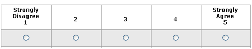
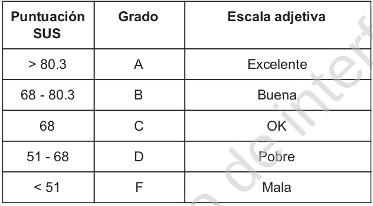
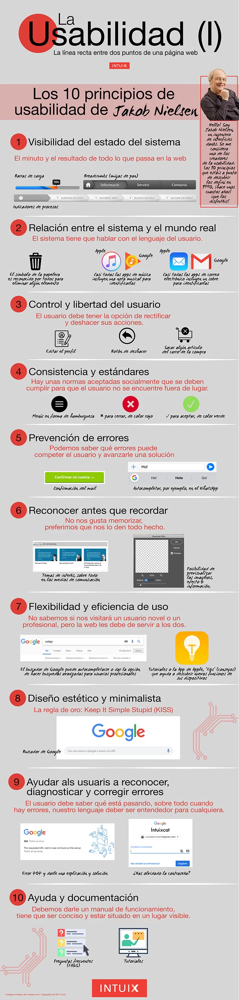

# Disseny Centrat en l'usuari - Disseny d'interfície d'usuari.

# Avaluació heuristica i test d'usuari.

L'avaluació heurística i els test d'usuari són dos técniques diferents per encontrar problemes d'usabilitat. Amb l'avaluació heurística, algú mira l'intericie d'usuari i identifica els problemes; mentres que amb els test d'usuari,, son els potencials usuarisels que proben l'apllicació. 
- Problemes trobats amb els **test d'usuari**: Reflecteixen problemes reials en el sentit de que, al menys un dels usuaris es troba amb eixos problemes. 
- Problemes trobats mitjançant **l'avaluació heuristica**: són problemes potencial. En que l'expert sospita que l'usuari pot tenir problemes amb eixa fiuncionalitat.  

## Test d'usuari

Són esencials en el procés de disseny d'aplicacions. Típicament consisteix en avaluar un producte, probant-lo amb usuaris representatius (hi haurà que reclutar-los). És la técnica més comú per comprovar l'usabilitat de l'interficie des del marc de disseny del centre humá. Aquesta técnica es centra en el que l'usuari fa i no en el que diu. L'objectiu d'aquesta técnica és:
- Obtenir informació dels nostres usuaris.
- Veure si complim les expectatives del usuari.
- Verificar si el disseny coincideix amb la decissió comercial per l'ús en el mon reial.
- Comprovar si l'usuari pot realitzar les tasques que hem propost.
- Averiguar si estem en el camí correcte.
- Obtenir les reaccions i comentaris dels usuaris.

Cap destacar que aquests test d'usuari es realitzen al llarg de tot el procés de disseny, i es repeteixen fins que el disseny respon a les expectatives dels usuaris.

### Pas 1. Crear un plá de test.

És el primer que s'ha de fer per realitzar un bon test d'usabilitat. Per aixó es necessari realitzar les seguents tasques:

1. **Definir l'àmbit del test**: És necessari decidir quines funcionalitats es volen provar. Important, no tenir més de 12 funcionalitats per provar en cada sessió.

2. **Reclutar usuaris**: pot realitzar-se per:
    - Demografia: Edat, lloc de residencia ...
    - psicografia: Antecedents cognitius, en cas de realitzar els escenaris propostos.
    Lo ideal, és reclutar els usuaris pensant en els dos aspectes, però tenint en compter la psicografia es poden  obtenir conneixements més relevants sobre l'ús i la adopció de l'aplicació. La pregunta clau que ens formulares és: Quants usuaris necessitem per al test?
    Per una vista ràpida, 5 usuaris per segment estaria bé.
    
 3. **Identificar els objectius**
    - Que volem lograr en aquest test
    - que s'està buscant?
    - que es vol demostrar als interesats?

4. Establir la mètrica. Aquestes donen una descripció comú basada en fets de l'acompliment del usuari/tasca sobre les quals prendre decisions de disseny sobre. Les métriques més comuns que es troben està:

    - Temps de resposta.
    - Rendiment
    - Tasa d'exit
    - Velocitat
    - Acompliment dels objectius
    - Coincidencia amb les expectatives.

### Pas 2. Facilitar el test

Algunes regles d'aquest pas són:

- Solicitar als usuaris que exterioritzen els pensaments i sentiments al interactuar amb l'aplicació.
- Pren notes (estructurades o no estructurades)
- simula un entorn reial. No ha de tractar de minimitzar-se les distraccions.
- Grava la sessió
- No guies al usuari
- Durant les sessions, no s'extrauen conclusions.
- No hi ha que vendre-li el producte al usuari. No hi ha que fer-li comentaris.

### Pas 3. Analitzar les dades

Quan hem acabat en totes les sessions de test, ha d'analitzar-se tota la informació i extraure conclusions. No hi ha cap regla comú per fer aço, però quan es té tota la informació, es tenen que cercar les tendencies que apareixen, prendre notes dels possibles problemes i les possibles solucions.

### Pas 4. Crear l'informe del test.

S'ha de crear un informe del test cada vegada que es realitze un test d'usabilitat i s'ha d'emmagatzemar junt a qualsevol altra documentació de test que se li ha fet a l'aplicació. Aquet informe ha d'incloure, per lo menys:

   - **Resument d'antecedents**: 
   
      - Resum del que s'ha provat
      - L'equip de test
      - Material utilitzat
      - Descripció de tot el que s'ha descubert en base al objectiu de la sessió.
      
   - **Metodologia**: On expliquem:

      - com s'han realitzat les session, tasques o escenaris que s'han provat.
      - Mètriques que s'ha seleccionat.
      - Descripció de cada segment d'usuari.
      
   - **Resultats del test**: on es resumeixen tots els resultats de les métriques que s'ha elegit.
   
   - **Descobriments i recomanacions**: S'ha de indicar tant els descobriments possitius (indiquen que estan en el cami correcte), com els negatius (hi haurà que resoldrels).
   
## Com fer un test d'usuari: Entrevistes

Un del test d'usuari més comú són les entrevistes individualitzades. Les quals són realitzades per investigadors qualificats en eXperiencia d'Usuari. Aquest métode d'investigació permet obtenir informació sobre les pautes de comportament, preferencia i opinió dels usuaris, amb el fi d'aplicar aquesta informació per obtenir una aplicació de major exit. La realització d'aquestos test en les primeres fases de procés de disseny permeteixen evitar futurs costres de redissenyament i llançar una aplicació facil d'utilitzar. Els test no requereixen una gran mostra de participants, ja que l'objectiu és juntar dades qualitatives. 

En la sessió de test d'usuari, es pot utilitzar una amplia gama d'eines. Així pues, en funció dels objectius de cada sessió de test, s'elegeix una técnica o un altra adaptan-se a les necessitats del test.

Cap destacar que els test d'usuari, generalment estan orientats a tasques. Les quals han de crear-se amb antelació i es demanarà al usuari que les complete, mentres un investigador li realitza una serie de perguntes que analitzarà i avaluarà en temps reïal. Un bon investigador arreplegarà els problemes de l'UX com i quan acorren, i seguiran una línea de questionari relevant. Derspres de les sessions de test, el nostre expert analitzarà el reultat a fons i proporcionarà una gama completa de solucions de disseny.

Un test d'usuari, també pot incloure activitats per informar de l'estructura i la navegació, com la classificació de targetes. També es poden inclouremesures típiques d'utilitat, com l'escala de qualificació del SUS (System Usability Scale), que és la mesura oficial de la satisfacció del usuari. Es tracta d'un questionari que l'usuari completa per obtenir la puntuació de satisfacció general. Aquest questionari conté 10 preguntes que els participants mitjançant una escala de Likert amb 5 opcions. En la que 1 significa completament desacord, i la 5 significa estar completament d'acord.

Les 10 preguntes del SUS, poden ser personalitzades per l'aplicació o funcionalitat a testejar són:

1. Crec que m'agradaria usar aquest sistema amb freqüència.
2. Vaig trobar el sistema innecessàriament complex.
3. Vaig pensar que el sistema era fàcil d'usar.
4. Crec que necessitaria el suport d'una persona tècnica per a poder utilitzar aquest sistema.
5. Vaig trobar que les diverses funcions en aquest sistema estaven ben integrades.
6. Vaig pensar que hi havia massa inconsistència en aquest sistema!
7. M'imagine que la majoria de la gent aprendria a usar aquest sistema molt ràpidament.
8. El sistema em va semblar molt incomoda d'usar.
9. Em vaig sentir molt segur usant el sistema.
10. Necessitava aprendre moltes coses abans de poder començar amb aquest sistema.

Les regles per obtenir la puntuació són:

- Per cada pregunta impar, es resta 1 a la puntuació (X-1). Per exemple, si en la primera pregunta "Crec que m'agradaria utilitzar aquesta aplicació amb freqüencia", l'usuari respon amb una puntuació de 4, la puntuació utilitzada per calcular la puntuació final es 3 -> = 4 - 1.

- Per cada pregunta número par, es resta la puntació a 5 (5-X). Per exemple, si en la segona pregunta "Vaig trobar el sistema innecessàriament complex", l'usuari contest 1, la puntuació utilitzada per calcular la puntuació final és 4 -> = 5-1.

- Es sumen les puntuacions de les preguntes pars e impars i després es multiplica per 2'5. Sent esta puntuació la nota final del test SUS.

- La puntuació SUS més alta és 100. Si s'obté un valor major que este, serà necessari revisar el càlcul.

Hi ha que tenir en compter, que es possible que no trobem el problema especific de l'aplicació o funcionalitat amb la puntuació obtinguda del SUS. Però pot ser una base per veure l'usabilitat de l'aplicació o fincionalitat. Hi ha que tenir en compter, quina és la puntuació mínima del SUS, per que la nostra aplicació o funcionalitat es considere com a bona. El promedi estandar, diu que que ha de ser com a mínim de 68. Si l'aplicació o funcionalitat és menor, es possible que haja que canviar o millorar l'usabilitat  de l'aplicació o de la funcionalitat analitzada. Seguidament, podem veure una taula base per interpretar els resultats del SUS:

### Altres Test

En l'actualitat existeixen online, alguns qüestionaris d'usabilitat que ja han sigut creats i provats. Cadascun és diferent per les seues dimensions, per la fiabilitat dels seus resultats i pel seu preu. 

La fiabilitat dels seus resultats està valorada entre 0 i 1.

- [SUMI](https://sumi.uxp.ie/): Núm. de preguntes: 50. Fiablidad: 0,92. Preu: $700

- [QUIS](https://www.cs.umd.edu/hcil/quis/): Núm. preguntes: 41-122. Fiablidad: 0,94. Preu: $750

- [PSSQ](https://www.conetrees.com/): Núm. de preguntes: 19. Fiablidad: 0,94. Gratis

- [SUS](https://measuringu.com/sus/): Núm. de preguntes: 10. Fiablidad: 0,91. Gratis

## Avaluació Heurística

Una Avaluació Heurística (AH) és un **mètode d'inspecció de la usabilitat sense usuaris**. Consisteix a examinar la qualitat d'ús d'una interfície per part de diversos avaluadors experts, a partir del compliment d'uns principis reconeguts d'usabilitat:** els heurístics**.

Igual que els Walkthroughs, el principal objectiu de l'AH és mesurar la qualitat de la interfície de qualsevol aplicatiu en relació a la seua facilitat per a ser aprés i usat per primera vegada. No obstant això, mentre els primers se centren en la consecució de tasques, les AH **inspeccionen problemes potencials**. Ja que l'avaluador es posa en la pell de l'usuari real del sistema, intentant **predir els errors** que podrà trobar-se.

### Com realitzar una avaluació heuristica

Ens ajudarem dels [10 principis del disseny proposats per Jakob Nielsen](../prototipat/deuPrincipisNielsen.html):

Quan es disposa de recursos, eds recomana que l'aplicació la probenn per lo menys 3 experts en usabilitat. Així, despres 'acordar un conjunt de directrius comunies, cada expert en usabilitat revisa l'aplicació per separat. Nielsen recomana que, algú que estiga familiartzat amb l'aplicació actue tant com a gracador i com aclarador. Responent a qualsevol pregunta aclaratoria que el revisor piga tenir sobre l'aplicació. Tal cosa augmenta l'eficiencia de l'avaluació.

Despres, serà necessari compilar, revisar i prioritzar les dades dels tres experts. El benefici de tenir multiples revisions, es que encara que segurament troben els mateixos errors. És probable que algun d'ells trobe alguno que la resta ha pasat per alt. 

En el cas de no disposar de recursos neecessaris per contratar a experts en usabilitat, es poden utilitzar la metodologia coneguda com "Heurisitic Markup" proposada per Leah buley en el seu llibre "The User Experience Team of One". Bàsicament, tracta en navegar per l'aplciació, de principi a fi, com es creu que ho faria un usuari. La idea, es posar-se en el lloc del usuari. Intentant dur a terme les tasques/funcionalitats específiques. 

### Conclusions sobre l'avaluació Heuristica

L'Avaluació heurística és una tècnica crucial i molt útil a l'hora de trobar errors d'usabilitat, sobretot en fases molt primerenques d'un projecte de disseny web. No obstant això, la popularització dels heurístics de Nielsen ha creat una falsa creença que dóna a entendre que solament amb complir una sèrie de principis heurístics ja basta per a considerar una aplicació com a usable.

Hem d'entendre llavors que les avaluacions heurístiques en cap cas substitueixen les avaluacions d'usabilitat amb usuaris reals. Solament les complementen. I és que, encara que en el global del procés de definició, disseny i implementació d'un sistema interactiu s'han de tindre en compte diferents tècniques per a assegurar la usabilitat, sempre s'ha de considerar a l'usuari com a centre de tot el procés.

Per a acabar, només afegir que en el meu pròxim post hi haurà una segona part d'aquesta publicació on s'aprofundirà en la metodologia a seguir per a preparar, executar i analitzar una avaluació heurística.

Fent clic al següent enllaç, pot observar un test d'usabilitat.

- [test d'usabilitat](testUsabilitat.html)

[back](../../metiprot.html)