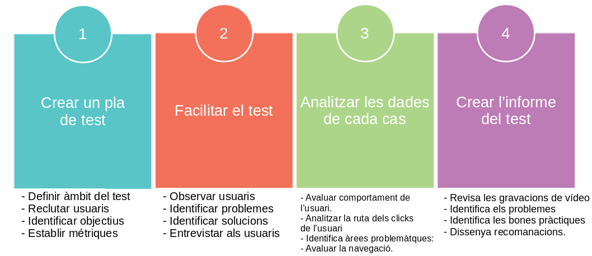

# Disseny Centrat en l'usuari - Disseny d'interfície d'usuari.

# Avaluació heuristica i test d'usuari.

L'avaluació heurística i els test d'usuari són dos técniques diferents per encontrar problemes d'usabilitat. Amb l'avaluació heurística, algú mira l'intericie d'usuari i identifica els problemes; mentres que amb els test d'usuari,, son els potencials usuarisels que proben l'apllicació. 
- Problemes trobats amb els **test d'usuari**: Reflecteixen problemes reials en el sentit de que, al menys un dels usuaris es troba amb eixos problemes. 
- Problemes trobats mitjançant **l'avaluació heuristica**: són problemes potencial. En que l'expert sospita que l'usuari pot tenir problemes amb eixa fiuncionalitat.  

## Test d'usuari

Són esencials en el procés de disseny d'aplicacions. Típicament consisteix en avaluar un producte, probant-lo amb usuaris representatius (hi haurà que reclutar-los). És la técnica més comú per comprovar l'usabilitat de l'interficie des del marc de disseny del centre humá. Aquesta técnica es centra en el que l'usuari fa i no en el que diu. L'objectiu d'aquesta técnica és:
- Obtenir informació dels nostres usuaris.
- Veure si complim les expectatives del usuari.
- Verificar si el disseny coincideix amb la decissió comercial per l'ús en el mon reial.
- Comprovar si l'usuari pot realitzar les tasques que hem propost.
- Averiguar si estem en el camí correcte.
- Obtenir les reaccions i comentaris dels usuaris.

Cap destacar que aquests test d'usuari es realitzen al llarg de tot el procés de disseny, i es repeteixen fins que el disseny respon a les expectatives dels usuaris.

### Pas 1. Crear un plá de test.