# Disseny Centrat en l'usuari - Disseny d'interfície d'usuari.

# El color en la interfaz d'usuari

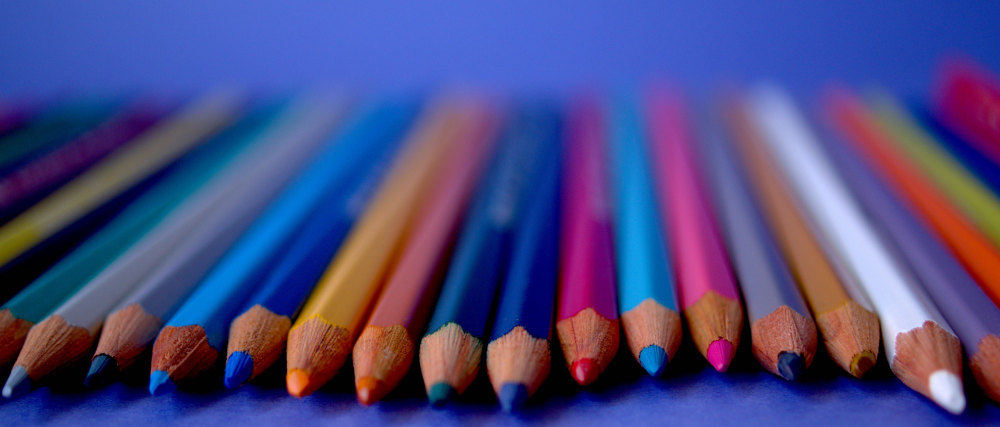

Tots estem envoltats de colors 24/7. Veiem coses i amb cada color que veiem tenim emocions diferents. Els colors ens afecten mental i físicament de moltes maneres. Per a augmentar la pressió arterial, s'ha mostrat un color roig fort, mentre que un color blau té un efecte calmant.

El color és l'aspecte més fàcil i important d'involucrar a l'usuari amb el producte en Disseny. Moltes persones creuen que triar colors per a la interfície d'usuari depén principalment del gust i el sentit de bellesa del dissenyador. No obstant això, el procés de selecció de color és més complicat del que sembla i juga un paper important en el disseny.

Pot crear un ambient amb colors, cridar l'atenció o fer una declaració. Per a energitzar o refredar, pots usar el color. Pot crear una atmosfera d'elegància, calidesa o tranquil·litat triant l'esquema de color adequat, o pot transmetre una imatge de joventut juganera.

L'elecció del color es basa en una certa psicologia i teoria del color. Llavors, comencem amb la psicologia del color.

## Psicologia del color

La preferència de color entre homes i dones és diferent. També varia amb els grups d'edat.

Segons l'estudi de Joe Hallock, existeix una diferència significativa en l'elecció del color entre gèneres. L'estudi es va realitzar per als colors més favorables i menys favorables.
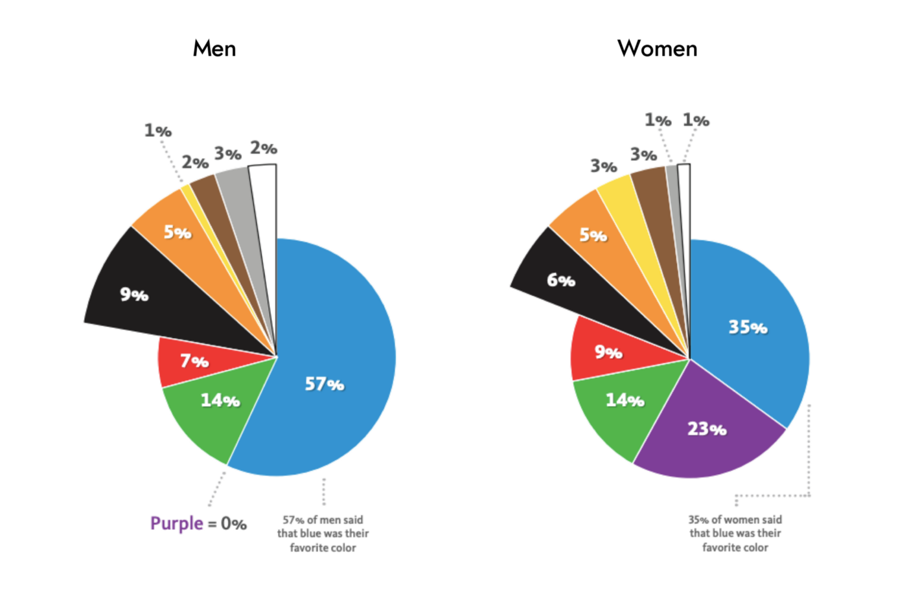

Com podem veure, el color blau és afavorit significativament tant per homes com per dones, i el marró és el color que menys li agrada.

### Ho entendrem amb una aplicació de demostració

L'objectiu és dissenyar una aplicació per a administrar les despeses i el públic objectiu és masculí i femení. Suposem que un dissenyador, que és un principiant i no sap més sobre el color, tria el marró com el color principal de l'aplicació perquè el marró és el seu color favorit. El resultat seria el següent:
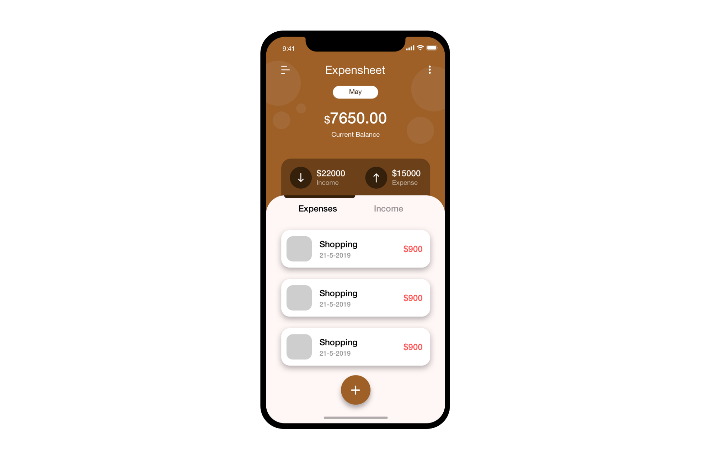

Podem veure clarament que el disseny és prou bo, però a causa de la selecció del color, l'aplicació pot no funcionar. Llavors, què podem fer per a millorar-ho? Més endavant, veurem què podem fer amb només un canvi de color.

El significat dels colors entra en joc. Els dissenyadors han de comprendre què signifiquen els colors i quina reacció provoquen per a transmetre el to, el missatge i cridar als usuaris adequats perquè prenguen l'acció esperada. Cada color té la seua pròpia influència en la nostra ment, i el coneixement de possibles reaccions pot ajudar els dissenyadors a transferir el missatge correcte i cridar els usuaris a prendre mesures.

Per saber el significat dels colors, pots clicar [ací](./significatColors.html).

## Teoria del color

En el disseny de la interfície, hi ha molts colors per utilitzar. El primer que ve a la ment quan parlem de colors és la famosa roda de colors.

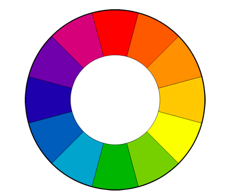

Ara, un altre tema important és com es poden combinar els colors. Hi ha diverses maneres de combinar colors, però els colors càlids i freds han d'estar equilibrats. Ací hi ha diverses maneres de combinar el color:

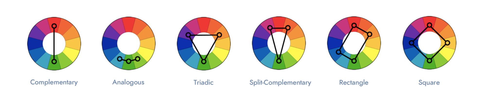

Hi ha 3 coses importants de color que tot dissenyador ha de saber quan parla de colors: **To, Valor i Saturació**. 

### To

El to és el color en estat natural. Blau, groc, verd, roig, etc. Sense cap variació clara i fosca. Bàsicament, els colors que apareixen en la roda de color sense cap altra alteració de llums i ombres. 

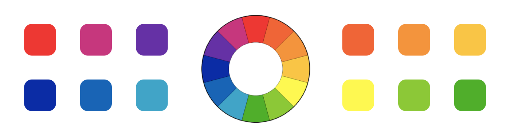

### Valor

El valor en color és la quantitat de llum i foscor que té el color. Naturalesa, per exemple. Veiem en la vida quotidiana que en el matí i en la nit alguns elements tenen un color diferent. Els arbres i les muntanyes, per exemple, tenen un to matutí més clar i tons més foscos a mesura que passa el dia pel fet que hi ha menys llum.
Foto de Nextvoyage de iconscout

Veiem coses més pròximes a la llum amb tons blancs i altres coses que estan en el fons amb més foscor.

El valor juga un paper important en el disseny de la interfície d'usuari. Podem obtindre un bon contrast si sabem usar-lo.

Si qualsevol color té el valor del 100%, resulta en color blanc. Quan un color té el valor 0% resulta en color negre. 
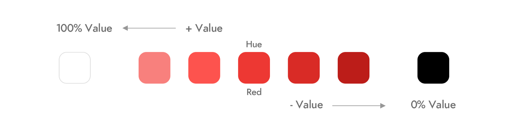

### Saturació

La saturació és la intensitat del color. Quan saturem un color, tenim un color més intens i viu. Quan desaturamos el color, tenim un color opac.
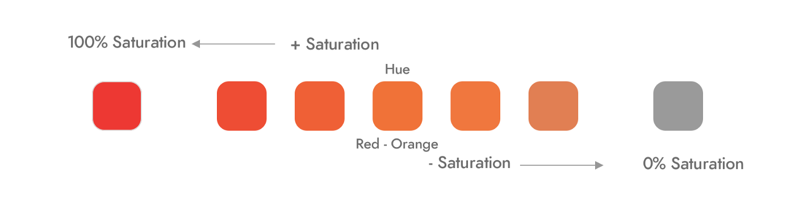

Abans d'utilitzar la saturació en el disseny, necessitem saber què estem dissenyant per a fins d'impressió o digitals. En el material d'impressió, no podem usar més saturació perquè s'usa CMYK i hi ha limitacions.

## Color en el disseny de la interfície d'usuari

### Proporció àuria - Regla 6: 3: 1

El principi de 60 per cent + 30 per cent + 10 per cent és la millor proporció per a aconseguir l'equilibri de color. Hem de triar un color dominant i usar-lo en el 60% de l'espai, un color secundari en el 30% i un color final en el 10% restant. Pot facilitar la vista dels usuaris per a moure's còmodament d'un punt a un altre.
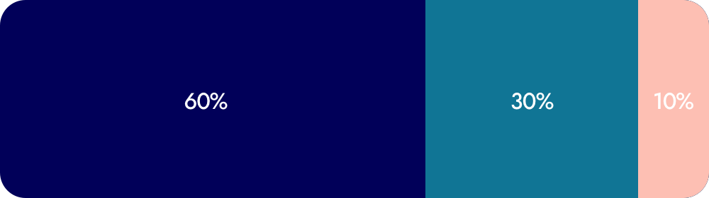

### Ombres en la interfície d'usuari

Les ombres mai són negres. L'ombra és el to de color de l'objecte ombrejat pels tons de valor. Veja la imatge com a referència a continuació.
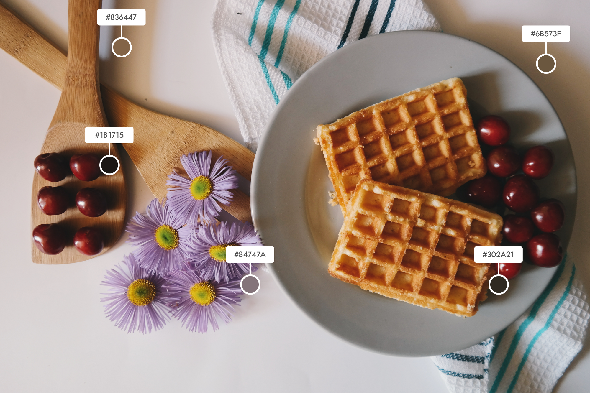

L'ombra de les cireres és roig fosc, es veu quasi negra, però no és negra. Mira l'ombra de les flors, el plat, el gofre. Depenent de la llum i la foscor, pot veure la quantitat d'ombra.

L'error comú que tots cometem en el disseny de la interfície d'usuari és que creiem que necessitem un color negre amb opacitat per a crear una ombra.

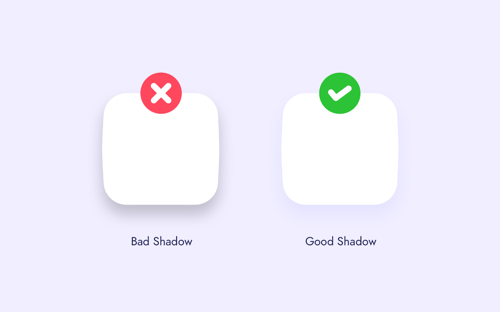

### Color en tipografia

La major part de la interfície d'usuari és blanca hui dia, tots se centren en fer que la interfície siga el més mínima possible. Llavors, la tipografia és un altre element important.

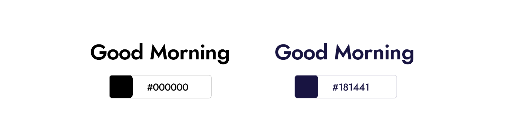

El color del text esquerre és negre (# 000000) i el del costat dret també es veu negre, però és blau fosc (# 181441). Això juga un paper important quan la interfície és principalment blanca. 

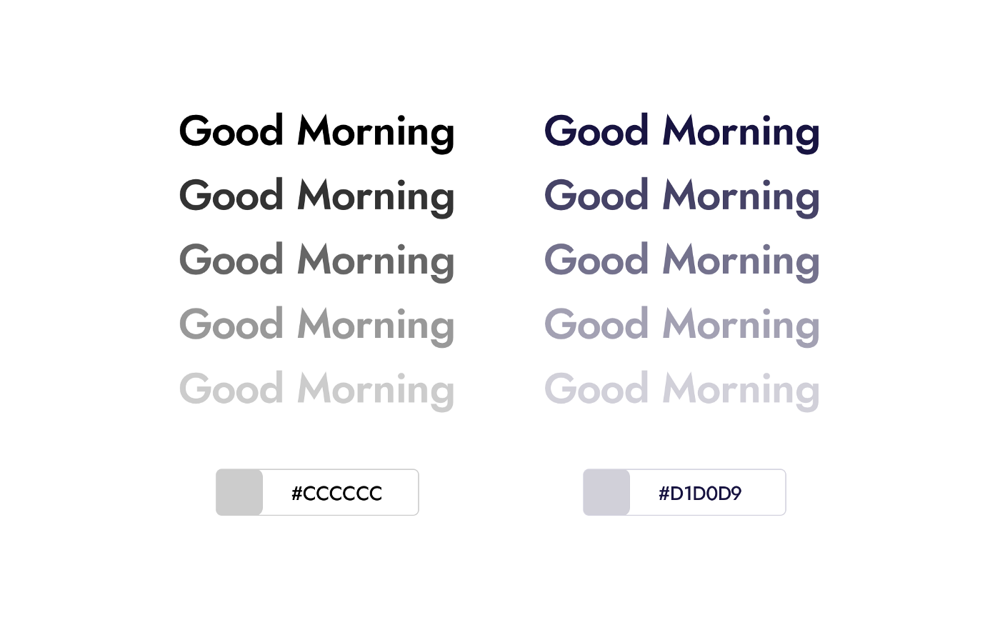

Després d'aplicar la mateixa opacitat a tots dos textos, podem veure la diferència. Clarament, el resultat és diferent. Un d'ells és gris, l'altre blau grisenc. Usar text amb un cert to de color tindrà un impacte notable en la UI.

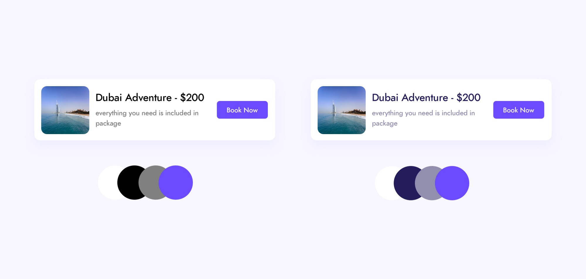

Aço no vol dir que utilitzar negre i gris siga dolent. Tot depen de la interficie o la persona. Però el to de color ve quan l'usem. Es pot aconseguir un millor contrast i harmonia.

## Continuem amb l'exemple del principi.

Si anem amb el color verd, l'aplicació hauria de veure's millor després d'aquestes coses. Pel fet que necessitem mostrar una gran emoció pels diners i el creixement en aquesta aplicació, i el color verd descriu els diners i el món financer, tant als homes com a les dones també els agrada el verd.

El resultat després de totes aquestes coses ha sigut atés:

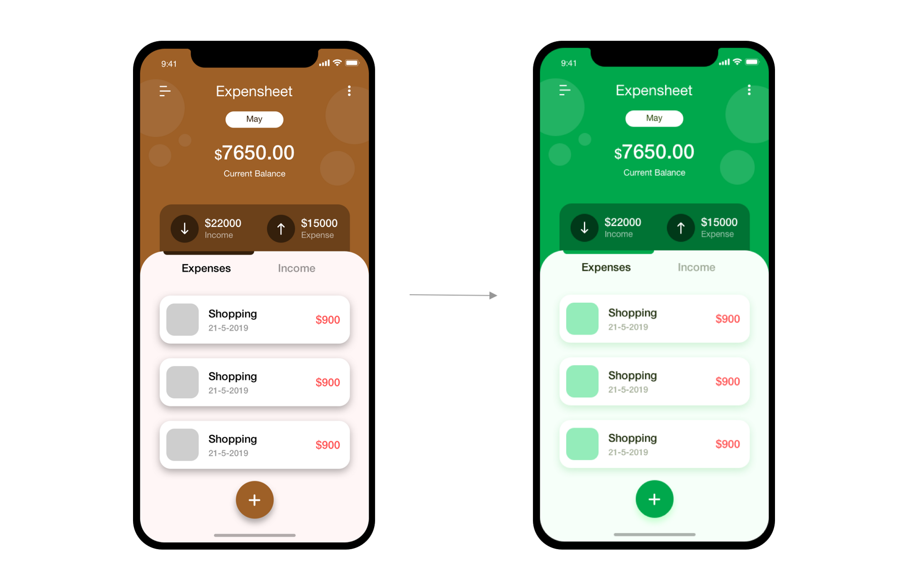

Es veu millor que abans. Com es pot veure, es pot dissenyar una interfície d'usuari efectiva si ens centrem en algunes coses sobre els colors.

[back](../metiprot.html)