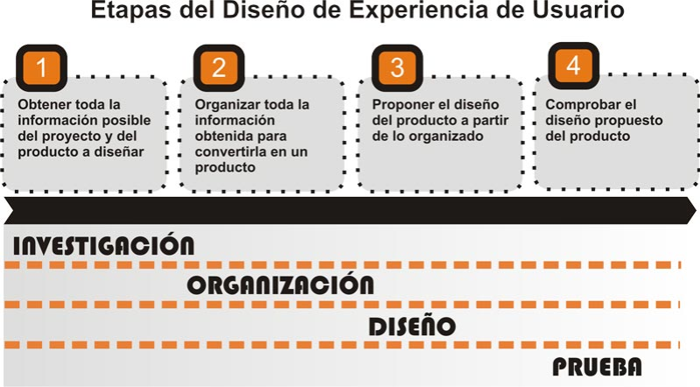

# Disseny Centrat en l'usuari

## Disseny d'experiencies d'usuari.

El rol que exerceix el Dissenyador d'Experiència d'Usuari dins del disseny de programari pot ser vist com un procés comunicatiu, inspirat en el model de comunicació de Shannon-Weaver. És a dir, el dissenyador es converteix en un mediador entre:

- Les necessitats comunicatives que estableix la persona o institució que sol·licita o encarrega el producte (clients).
- Les necessitats informatives i funcionals de les persones que usaran el producte (usuaris).

El dissenyado r ha de lograr un equilibri en el proces comunicatiu entre emisors (clients) i receptors (usuaris).

Existeix una frase que actualment s'ha convertit en un lema per a tots els que s'exerceixen com a dissenyadors d'experiència d'usuari: 
>“Depén”

En el disseny de programari no existeix gens absolut, les decisions de disseny més encertades varien en funció del context, els continguts i els usuaris. És per això que resulta difícil definir pautes o metodologies rígides per a la seua realització, i es fa imprescindible que els dissenyadors afronten de manera flexible cada projecte concret.

### Metodologia

L'enfocament metodològic proposat en el present treball es basa en les etapes del disseny de programari descrites anteriorment. Un enfocament que consta de quatre elements bàsics per a la seua comprensió:

- **Etapes**: Són les que responen al temps transcorregut **quan?**
- **Activitats o tasques**: Són les que responen al procés **què?**
- **Tècniques**: Són les que responen al que es fa per a aconseguir els processos i tasca **com?**
- **Eines**: Són les que responen a què s'usa per a aplicar les tècniques **amb què?**

### Etapes
Les etapes es divideixen en quatre moments per els que transcurreixen le labor del dissenyador del software:

1. **Investigació**: en la qual s'obté tota la informació possible del projecte, usuaris i producte a dissenyar.
1. **Organització**: en la qual es processa tota la informació per a convertir-la en un producte.
1. **Disseny**: en la qual es plasma el disseny del producte a partir de l'organitzat.
1. **Prova**: en la qual es comprova la qualitat del disseny proposat.

El resultat d'aquesta etapa es materialitza en forma d'entregable o artefacte

### Activitats o tasques
En la següent imatge es mostren les activitats o tasques que es realitzarien primcipalment dorant cada etapa.

#### Etapa 1. Investigacio
 
Durant aquesta etapa es tracta d'obtindre la major quantitat d'informació possible i necessària per al projecte a realitzar, tant sobre el client com dels usuaris. El correcte balanç entre demandes i necessitats dels uns i els altres és el que porta a l'èxit el producte a crear.

- Informació relacionada amb el projecte
	- Definir les necessitats generals del projecte.
	- Definir la temàtica general del producte a realitzar o redissenyar.
	- Definir els objectius dels clients o emissors amb el producte.
	- Definir la intensión comunicativa del producte (Informar, entretindre, alertar)
	- Definir la tipologia de producte que es desitja.
	- Definir de manera general als usuaris del producte, el seu context d'ús, i els continguts que tindrà el mateix.
- Estudi d'Usuaris (receptors)
	- Caracteritzar als usuaris. (tipologia, rols, etc.)
		- Definir perfils d'usuaris.
	- Investigar les seues necessitats. (d'informació, formació, etc.)
	- Definir escenaris.
	- Definir els processos que realitzen els usuaris en els seus contextos reals.
- Estudi del Context
	- Definir les característiques del context d'ús (culturals, polítiques, econòmiques, socials i tecnològiques).
	- Definir el model de negoci.
	- Realitzar una matriu DAFO (FODA).
	- Definir un banc de problemes del context d'ús.
	- Realitzar fluxogrames de processos i activitats.
	- Realitzar un estudi de mercat i/o de productes similars al que es vol realitzar o redissenyar.
  - En cas d'estar redissenyant un producte
	- Realitzar una anàlisi de l'ús del mateix (Exemple: Logs, Google Analytics).
	- Realitzar una avaluació del producte existent per a determinar la seua qualitat.
- Estudi dels Continguts
	- Realitzar un inventari de recursos d'informació del producte.
	- Realitzar mapes de conceptes (Concept Map).
	- Realitzar mapes de continguts (Content Map).
- Estudi del procés de disseny
	- Definir una estratègia de treball.
	- Analitzar els recursos de treball amb què es compte.
	- Planificar el temps de treball.

1. Els artefactes generats durant aquesta etapa serien: Informes i Diagrames en forma d'organigrames i mapes.

#### Etapa 2. Organització
Aquesta és l'etapa que més es relaciona amb l'expressió artística. És quan el dissenyador usa tant criteris cientificotècnics com culturals per a organitzar tota la informació obtinguda durant l'etapa anterior.

- Representar totes les estructures possibles dels continguts, en correspondència a les necessitats d'usuaris i el seu context.
- Definir de totes les maneres de jerarquitzar les temàtiques i els continguts.
- Fer correspondre les estructures plantejades a les necessitats tant d'emissors (clients) com de receptors (usuaris).
- Definir tots els fluxos funcionals que tindrà el producte de programari, corresponent amb els fluxos reals dels usuaris en el seu context.

Els artefactes generats durant aquesta etapa serien: **Diagrames manuscrits i anotacions en forma d'esborrany.**

#### Etapa 3. Disseny
 És l'etapa en la qual es plasmen els resultats de l'etapa anterior, ara amb tots els requeriments tècnics amb la finalitat que siguen compresos per usuaris, client i la resta de l'equip de treball.

- Definir l'estructura del producte (taxonomia i diagrames d'organització o blueprints).
- Definir el funcionament del producte (diagrames de funcionament).
- Definir les pantalles del producte (diagrames de presentació o wireframes).
- Definir els serveis i funcionalitats que tindrà el producte.
- Definir les etiquetes del producte (labeling).
- Crear prototips de baix i alt nivell.

Els artefactes generats durant aquesta etapa serien: Diagrames digitals i prototips, informes del producte.

#### Etapa 5. Prova
És l'etapa en la qual es comproven les propostes de disseny. Les proves es realitzen tant amb clients com amb usuaris. Amb els clients amb l'objectiu de saber si s'han aconseguit els objectius i demandes plantejades. I amb els usuaris, amb l'objectiu de saber resoltes les necessitats identificades.

- Proves de prototips.
- Revisió de diagrames.
- Comprovació de robustesa en l'etiquetatge.
- Comprensió dels serveis dissenyats per part dels usuaris.

Els artefactes generats durant aquesta etapa serien: Informes avaluatius
### Tècniques
Les tècniques no estan obligatòriament relacionades amb les activitats ni les etapes, per la qual cosa poden usar-se en qualsevol moment del projecte. Tot depén del que es vulga obtindre amb la tècnica. Hi ha tècniques que tenen major ús durant alguna etapa o activitat, però no per ells estan restringides a aquestes. Si es necessita, es poden mesclar tècniques entre si per a aconseguir algun objectiu específic. Per exemple: Aplicar un card sorting a experts, o realitzar una tempesta d'idees dins d'un Disseny Participatiu.

Es mostren algunes tècniques usades segons la seua funció principal, encara que no exclusiva:

Tècniques bàsiques dins d'un procés de disseny:

- Reunió
- Entrevista i Enquesta
- Observació
- Revisió bibliogràfica
- Consulta a expert
- Representació i mapatge

Tècniques molt usades per a la cerca d'informació:

- Tempesta d'idees (brainstorming).
- Focus group
- Crítica de dissenys anteriors.
- Disseny participatiu.
- Tempesta d'idea de necessitats d'informació (brainstorming).
- Escenaris.
- Persones.
- Benchmarking (anàlisi competitiva).
- Anàlisi de freqüència de text (repetició de termes i conceptes en els contextos).

Tècniques molt usades per a l'organització:

- Organització de targetes (card sorting).
- Agrupació (finalitzant en un Diagrama d'Afinitat).
- Seqüència (Anàlisi de seqüència) (Ronda León, Mesa Rábade; 2005).
- Tabulació de continguts (crear taules amb els diferents continguts a organitzar).
- Validació de termes.

Tècniques molt usades per al funcionament del producte:

- Anàlisi de tasques (Task Analysis).
- Fluxogrames.
- Passeig cognitiu (Cognitive Walkthrough).

Tècniques molt usades per a dissenyar el producte:

- Diagramació en paper.
- Diagrama d'organització (Blueprint)
- Diagrama de funcionament (Flow diagram).
- Diagrama de presentació (Wireframe).
- Etiquetatge (Labeling).
- Prototipado digital.

Tècniques usades per a fer els test del disseny plantejat:

- Crítica de disseny amb usuaris i clients (Critic design).
- Proves amb usuaris (User test).
- Avaluació heurística (Heuristic test).
- Mapatge de clics dins de la pantalla del producte (MouseTracking).
- Monitoratge o seguiment visual (EyeTracking).

### Eines
Les eines per al treball del dissenyador d'experiència d'usuari varien segons les possibilitats econòmiques i tecnològiques del projecte. En el mercat existeixen tant eines professionals d'un alt cost monetari com a eines gratuïtes.

Per al maneig de la informació amb usuaris podem comptar amb les enquestes online, eines que permeten dissenyar un enquesta en línia i que els usuaris, de manera remota, la responguen.

Com a exemples tenim:

- Survey Manager de Netquest (www.solucionesnetquest.com/survey_manager)
- E-enquestes (www.e-encuesta.com)

Per al mapatge de continguts i conceptes es poden usar algunes aplicacions com ara:

- MindManager de MindJet (www.mindjet.com)
- CMapTools. (http://cmap.ihmc.us)
- Freemind (http://freemind.sourceforge.net)
- PowerMapper (www.powermapper.com)
- Xtreeme SiteXpert (www.xtreeme.com/sitexpert)

Per a la representació de continguts, ja siga en diagrames o prototips, les següents eines tendeixen a ser molt acceptades:

- Axure RP Pro (www.axure.com)
- SmartDraw (www.smartdraw.com)
- Microsoft Visio (www.microsoft.com)
- OmniGraffle (OSX) (www.omnigroup.com)
- iGrafx Flowcharter (www.igrafx.com)

Encara que existeixen nombroses aplicacions que serveixen d'eines per al treball del dissenyador d'experiència d'usuari, el paper i el llapis han sigut i continuen sent les més usades. És clar que els “tables” amb les seues pantalles “touch” han vingut a substituir en alguns casos al paper i al llapis, gràcies a les aplicacions que funcionen com a tals en aquests dispositius.
[back](../metiprot.html)
