# Disseny Centrat en l'usuari - Disseny d'interfície d'usuari.

## Jerarquia Visual.

La jerarquia visual és una de les técniques bàsiques que s'aplica al procés de disseny. es basa inicialment en la teoria psicolófica de Gestalt, que examina la percepció visual dels elements en relació amb els demes i mostra com els usuaris tendeixen a unificar els elements visuals en grup. 

La jerarquia visual té com objectiu presentar el contingut d'una aplicació de tal manera que els usuaris poden comprendre el nivell d'importancia de cada element. Per aixó, organitza els elements de l'interficie de forma que el cervell puga distinguir els objectes en base a les diferencies físiques, com el tamany, color, contraste, estil, etc... 

De fet, la presentació visual dels elements de l'interficie d'usuari té una gran influencia en l'experiencia de l'usuari d'una aplicació. Si els components de contingut es veuen com un desastre, l'usuari no pot navegar dintre de l'aplicació o interactuar amb ella de forma adecuada. 

### Conceptes i exemples de jerarquia visual:

Dins de les tècniques a aplicar a una interfície, les de jerarquia visual són d'allò més important, perquè depenent de com s'apliquen, fan que la tasca a realitzar per part de l'usuari, es comprenga o resulte confusa
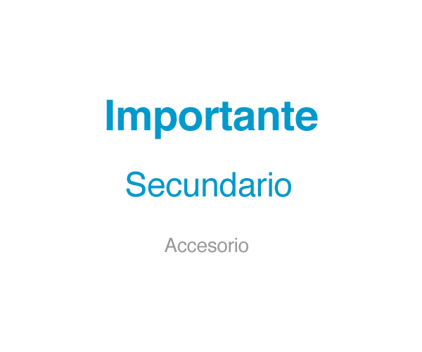
### Claus

Emfatitza la informació més important i minimitza la menys important

- Identifica l'ordre d'importància dels elements de la interfície
- Estableix una pauta de moviment per a guiar als usuaris
- Crear un centre d'interés que atraga l'atenció. L'atenció ha de recaure sobre un nombre reduït d'elements i aquests han de ser clau en eixa pantalla

Usar els atributs preatencionales per a generar una jerarquia clara:

- **Moviment**. El que genera moviment té més importància jeràrquicament que el que està estàtic
- **Localització**. La posició superior és més important que la inferior
- **Grandària**. La grandària major és més important que el menor
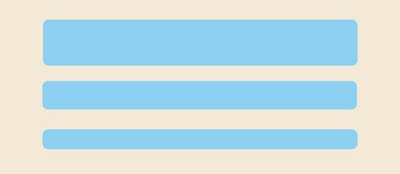
- **Contrast**. Quanta més diferència de contrast (Ej: blanc sobre negre) cridarà més l'atenció que els tons menys contrastats.
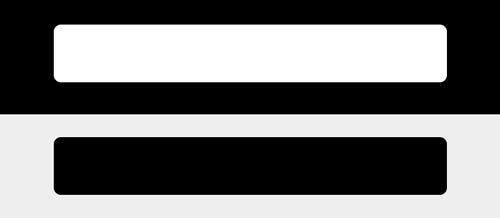
- **Color**. Els colors càlids (roig, groc, taronja) són més pròxims es perceben com més importants que els freds (blaus, violetes, indis)

- **Saturació**. En un matís de color, com més pur (saturats) s'entendrà més important que un altre més clar o desaturado (en gris)

- **Rostres**. Les cares humanes criden poderosament l'atenció respecte a una altra mena d'imatges o il·lustracions
- **proximitat** . És una manera de separar i agrupar elements. Mentre més pròxims estiguen són considerats com un grup i es poden identificar com sub-jerarquies. La proximitat serveix per a agrupar elements similars i separar aquells que són diferents, per això és de molta importància al moment de dissenyar un lloc web.
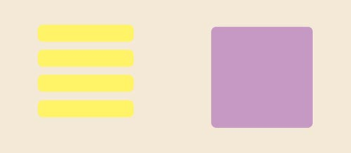
- **Alineació**. La ubicació dels elements també pot indicar importància. Seguint l'exemple mostrat a continuació, sabem que els elements situats en la barra lateral són de menor importància que els elements que se situen en el centre perquè ocupen un major espai. D'igual manera, els elements que es col·loquen en la part superior solen ser de major importància, per això aqueix lloc és el comú per a la barra de menú i el logo. En una botiga online, el carret de compres també es sol situar en la part superior.
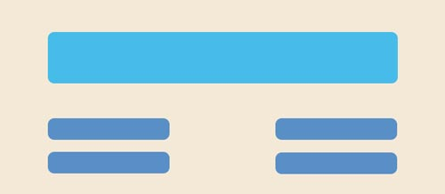
- **Repetició**. La repetició és un element que també serveix per a agrupar elements. Si prenem com a exemple el text dins d'una pàgina web veiem que cada paràgraf té una font i una puntaje igual. Això permet a l'usuari reconéixer fàcilment els elements similars.
	Encara que la repetició és importants, és també essencial saber com trencar eixa repetició per a generar interés, en cas contrari la pàgina es veuria massa estàtica i avorrida. Prenent com a exemple el text, veiem que cada cert nombre de paràgrafs es col·loca un subtítol, usualment en major puntaje o en negretes o amb alguna mena de format diferent que el del paràgraf. Aquest subtítol funciona com un element que genera un trencament visual.
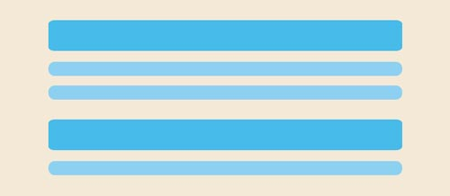
- **El espaiat**: És un dels principis de disseny més descurats però també és un dels més importants.
	L'espai en blanc és essencial per a separar i organitzar els elements i ajudar al fet que el disseny es veja ordenat i ben equilibrat. D'aquesta manera dónes un respir als ulls de l'espectador perquè puga centrar la seua atenció en els elements que realment importen.
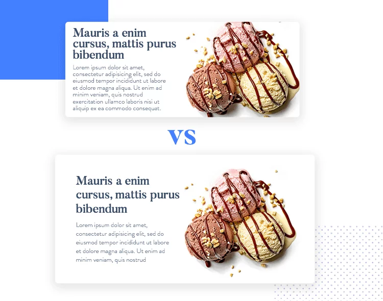
- **Layout**: La distribució dels elements en una interficie d'usuari està directament relacionada amb l'atenció que requereix. No obstant, cada persona visualitza el contingut de maner diferent. De fet, existeixen diferents patrons de seguiment ocular que representen com interactuen els usuaris amb les interficies en els primers segons. Açó ens pot ajudar als dissenyadors a prioritzar els continguts, col·locar l'informació important en  les zones visibles primaries  i establir una forta jerarquia visual.
	Per saber més aspects relacionats amb els patrons, pots clicar [ací](https://appdesignbook.com/es/contenidos/patrones-interaccion-moviles).
	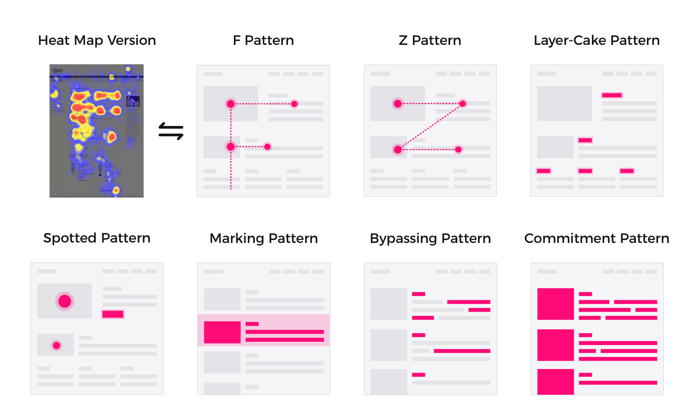
	Els patrons més utiilitzats són els que tenim a continuació:
	- Patró F: El patró d'escaneig en forma de F es caracteritza per moltes fixacions concentrades en la part superior i esquerra de la pàgina. Específicament:
		1. Els usuaris lligen primer en un moviment horitzontal, generalment en la part superior de l'àrea de contingut. Aquest element inicial forma la barra superior de F.
		2. Després, els usuaris baixen una mica la pàgina i després lligen en un segon moviment horitzontal que generalment cobreix una àrea més curta que el moviment anterior. Aquest element addicional forma la barra inferior de la F.
		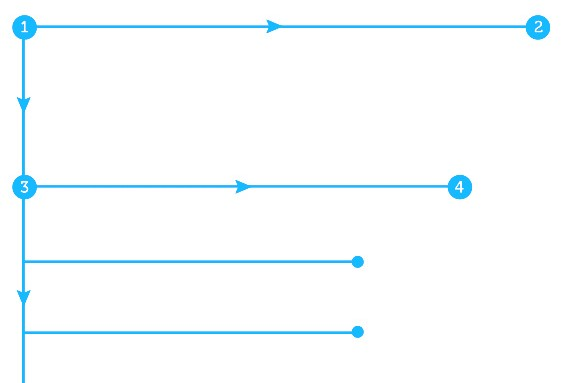
		3. Finalment, els usuaris escanegen el costat esquerre del contingut en un moviment vertical. A vegades, aquest és un escaneig lent i sistemàtic que apareix com una franja sòlida en un mapa de calor de seguiment ocular. Altres vegades, els usuaris es mouen més ràpid, creant un mapa de calor més spottier. Aquest últim element forma la tija de F.
		
		Les implicacions d'aquest patró són:
			- Les primeres línies de text en una pàgina reben més mirades que les línies de text posteriors en la mateixa pàgina.
			- Les primeres paraules a l'esquerra de cada línia de text reben més fixacions que les paraules subsegüents en la mateixa línia. 
	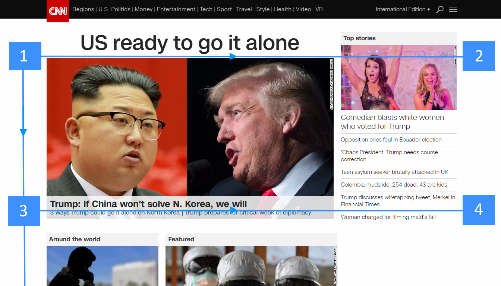
	- Patró z: Segueix la forma de la lletra Z. Un disseny del patró z traça la ruta que recorre l'ull humà quan escaneja la pàgina, d'esquerra a dreta, de dalt a baix:
		- Primer, les persones escanegen des de la part superior esquerra a la part superior dreta, formant una línia horitzontal
		- Després, cap avall i cap al costat esquerre de la pàgina, creant una línia diagonal
		- Finalment, de tornada a la dreta novament, formant una segona línia horitzontal
		Quan els ulls dels espectadors es mouen en aquest patró, es forma una "Z" imaginària:
	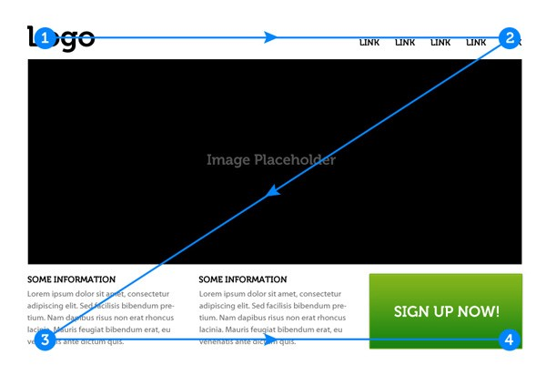
		Aquest patró funciona perquè la majoria dels lectors occidentals escanejaran la seua pàgina de la mateixa manera que escanejarien un full de paper: de dalt a baix, d'esquerra a dreta.
		L'escaneig de Z-Pattern ocorre en pàgines que no estan centrades en el text (per a pàgines amb molt de text com a articles o resultats de cerca, és millor usar F-Pattern). Això fa que el patró z siga una bona solució per a dissenys simples amb una còpia mínima i alguns elements clau que han de veure's. Les pàgines minimalistes o les pàgines de destí centrades principalment en un o dos elements principals poden implementar el patró Z perquè el procediment d'escaneig de pàgines siga molt més fàcil per als visitants del lloc.
		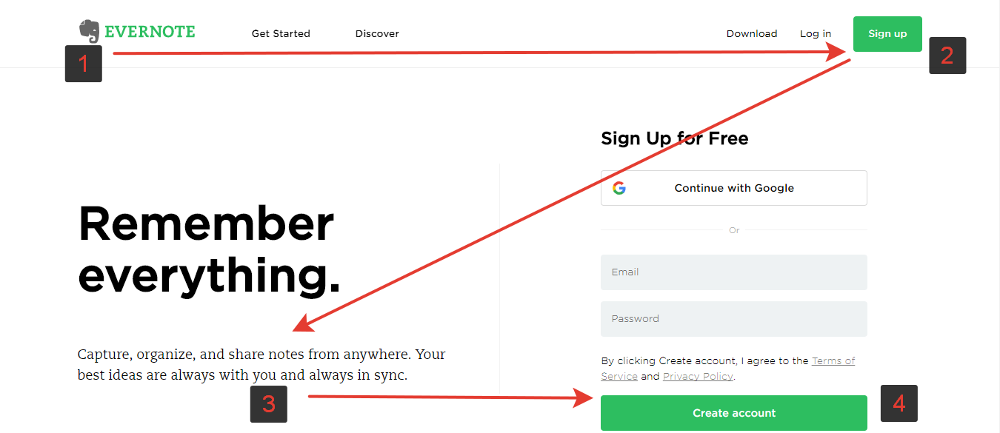
	- Altres patrons utilitzats són:
		- Layer-cake Pattern: els usuaris segueixen aquest patró en escanejar encapçalats i subtítols per a determinar ràpidament on (i si) la informació que busquen es pot trobar en la pàgina.
		- spotted Patern: les creativitats solen seguir aquest model d'escaneig, on ometen grans fragments de text i escanegen components visuals com el color, les formes i les anomalies de proporció per a trobar una informació específica.
		- Marking pattern: igual que un ballarí que es fixa en un objecte per a mantindre's equilibrat mentre giren, els usuaris mantenen l'ull enfocat en un lloc mentre es desplacen, un patró molt comú per a UX mòbil.
		- Bypassing Pattern: els usuaris ometen deliberadament les primeres paraules d'una línia quan diverses línies de text en una llista comencen totes amb les mateixes paraules.
		- Commitment Pattern: Aquest és un patró extrany i només ocorre quan un usuari està molt interessat en el contingut i està motivat per a consumir-lo tot.
		
### Exemples:

#### Exemple 1. Pagina inici de Highrise. 

En aquesta pàgina de Highrise de la jerarquia està ben lograda. La cara (1) és el que més predomina en tota la composició, vinculandola amb la marca (2), per a finalment guiar la mirada de l'usuari cap al text (3) i finalment pot veure el botó verd (4).

#### Exemple 2. Google Drive. 
En la interfície de Google Drive (abans Google Docs) el boton “Crear + pujar” (1) és més important visualment que el botó “buscar” (2).
Quan passem sobre els elements aquests es ressalten en groc (3) i es transforma en un element jeràrquicament més important que la resta de línies. 
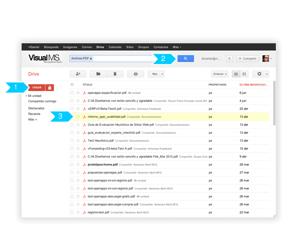
[back](../metiprot.html)