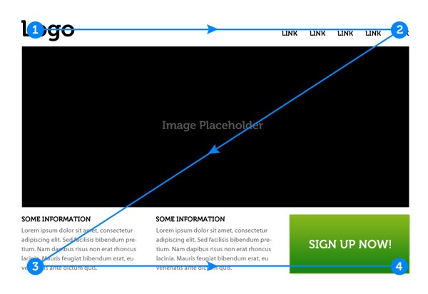

# Disseny Centrat en l'usuari - Disseny d'interfície d'usuari.

# Jerarquia Visual.

La jerarquia visual és una de les técniques bàsiques que s'aplica al procés de disseny. es basa inicialment en la teoria psicológica de Gestalt, que examina la percepció visual dels elements en relació amb els demes i mostra com els usuaris tendeixen a unificar els elements visuals en grup. 

La jerarquia visual té com objectiu presentar el contingut d'una aplicació de tal manera que els usuaris poden comprendre el nivell d'importancia de cada element. Per aixó, organitza els elements de l'interficie de forma que el cervell puga distinguir els objectes en base a les diferencies físiques, com el tamany, color, contraste, estil, etc... 

De fet, la presentació visual dels elements de l'interficie d'usuari té una gran influencia en l'experiencia de l'usuari d'una aplicació. Si els components de contingut es veuen com un desastre, l'usuari no pot navegar dintre de l'aplicació o interactuar amb ella de forma adecuada. 

Dins de les tècniques a aplicar a una interfície, les de jerarquia visual són d'allò més important, perquè depenent de com s'apliquen, fan que la tasca a realitzar per part de l'usuari, es comprenga o resulte confusa.

A continuació es mostren un conjunt de atributs per ajudar a generar una jerarquia clara:

## Moviment
El que genera moviment té més importància jeràrquicament que el que està estàtic

## Localització
La posició superior és més important que la inferior

## Grandària
La grandària major és més important que el menor

## Contrast. 
Quanta més diferència de contrast (Ej: blanc sobre negre) cridarà més l'atenció que els tons menys contrastats.

## Color
Els colors càlids (roig, groc, taronja) són més pròxims es perceben com més importants que els freds (blaus, violetes...). Podem ampliar els coneixements dels colors [ací](./colors.html).

## Saturació
En un matís de color, com més pur (saturats) s'entendrà més important que un altre més clar o desaturado (en gris)

## Rostres
Les cares humanes criden poderosament l'atenció respecte a una altra mena d'imatges o il·lustracions

## proximitat 
És una manera de separar i agrupar elements. Mentre més pròxims estiguen són considerats com un grup i es poden identificar com sub-jerarquies. La proximitat serveix per a agrupar elements similars i separar aquells que són diferents, per això és de molta importància al moment de dissenyar un lloc web.

## Alineació
La ubicació dels elements també pot indicar importància. Seguint l'exemple mostrat a continuació, sabem que els elements situats en la barra lateral són de menor importància que els elements que se situen en el centre perquè ocupen un major espai. D'igual manera, els elements que es col·loquen en la part superior solen ser de major importància, per això aqueix lloc és el comú per a la barra de menú i el logo. En una botiga online, el carret de compres també es sol situar en la part superior.

## Repetició 
La repetició és un element que també serveix per a agrupar elements. Si prenem com a exemple el text dins d'una pàgina web veiem que cada paràgraf té una font i una puntaje igual. Això permet a l'usuari reconéixer fàcilment els elements similars.
	Encara que la repetició és importants, és també essencial saber com trencar eixa repetició per a generar interés, en cas contrari la pàgina es veuria massa estàtica i avorrida. Prenent com a exemple el text, veiem que cada cert nombre de paràgrafs es col·loca un subtítol, usualment en major puntaje o en negretes o amb alguna mena de format diferent que el del paràgraf. Aquest subtítol funciona com un element que genera un trencament visual.

## El espaiat
És un dels principis de disseny més descurats però també és un dels més importants.
	L'espai en blanc és essencial per a separar i organitzar els elements i ajudar al fet que el disseny es veja ordenat i ben equilibrat. D'aquesta manera dónes un respir als ulls de l'espectador perquè puga centrar la seua atenció en els elements que realment importen.

## Layout 
La distribució dels elements en una interficie d'usuari està directament relacionada amb l'atenció que requereix. No obstant, cada persona visualitza el contingut de maner diferent. De fet, existeixen diferents patrons de seguiment ocular que representen com interactuen els usuaris amb les interficies en els primers segons. Açó ens pot ajudar als dissenyadors a prioritzar els continguts, col·locar l'informació important en  les zones visibles primaries  i establir una forta jerarquia visual.
	Per saber més aspects relacionats amb els patrons, pots clicar [ací](https://appdesignbook.com/es/contenidos/patrones-interaccion-moviles).
	
	Els patrons més utiilitzats són els que tenim a continuació:
### Patró F
El patró d'escaneig en forma de F es caracteritza per moltes fixacions concentrades en la part superior i esquerra de la pàgina. Específicament
1. Els usuaris lligen primer en un moviment horitzontal, generalment en la part superior de l'àrea de contingut. Aquest element inicial forma la barra superior de F.
2. Després, els usuaris baixen una mica la pàgina i després lligen en un segon moviment horitzontal que generalment cobreix una àrea més curta que el moviment anterior. Aquest element addicional forma la barra inferior de la F.
	
3. Finalment, els usuaris escanegen el costat esquerre del contingut en un moviment vertical. A vegades, aquest és un escaneig lent i sistemàtic que apareix com una franja sòlida en un mapa de calor de seguiment ocular. Altres vegades, els usuaris es mouen més ràpid, creant un mapa de calor més spottier. Aquest últim element forma la tija de F.
	
	Les implicacions d'aquest patró són:
	- Les primeres línies de text en una pàgina reben més mirades que les línies de text posteriors en la mateixa pàgina.
	- Les primeres paraules a l'esquerra de cada línia de text reben més fixacions que les paraules subsegüents en la mateixa línia. 
	
### Patró z
Segueix la forma de la lletra Z. Un disseny del patró z traça la ruta que recorre l'ull humà quan escaneja la pàgina, d'esquerra a dreta, de dalt a baix:
	- Primer, les persones escanegen des de la part superior esquerra a la part superior dreta, formant una línia horitzontal
	- Després, cap avall i cap al costat esquerre de la pàgina, creant una línia diagonal
	- Finalment, de tornada a la dreta novament, formant una segona línia horitzontal
	Quan els ulls dels espectadors es mouen en aquest patró, es forma una "Z" imaginària:
	
	
	
Aquest patró funciona perquè la majoria dels lectors occidentals escanejaran la seua pàgina de la mateixa manera que escanejarien un full de paper: de dalt a baix, d'esquerra a dreta.

L'escaneig de Z-Pattern ocorre en pàgines que no estan centrades en el text (per a pàgines amb molt de text com a articles o resultats de cerca, és millor usar F-Pattern). Això fa que el patró z siga una bona solució per a dissenys simples amb una còpia mínima i alguns elements clau que han de veure's. Les pàgines minimalistes o les pàgines de destí centrades principalment en un o dos elements principals poden implementar el patró Z perquè el procediment d'escaneig de pàgines siga molt més fàcil per als visitants del lloc.
		

		
### Altres patrons utilitzats són:

- Layer-Cake Pattern: els usuaris segueixen aquest patró en escanejar encapçalats i subtítols per a determinar ràpidament on (i si) la informació que busquen es pot trobar en la pàgina.
- spotted Patern: les creativitats solen seguir aquest model d'escaneig, on ometen grans fragments de text i escanegen components visuals com el color, les formes i les anomalies de proporció per a trobar una informació específica.
- Marking pattern: igual que un ballarí que es fixa en un objecte per a mantindre's equilibrat mentre giren, els usuaris mantenen l'ull enfocat en un lloc mentre es desplacen, un patró molt comú per a UX mòbil.
- Bypassing Pattern: els usuaris ometen deliberadament les primeres paraules d'una línia quan diverses línies de text en una llista comencen totes amb les mateixes paraules.
- Commitment Pattern: Aquest és un patró extrany i només ocorre quan un usuari està molt interessat en el contingut i està motivat per a consumir-lo tot.

## Tipografia

El contingut és una part significativa de qualsevol disseny d'interficie d'usuari. Per tal cosa, la tipografia afecta en gran mesura a la jerarquia visual. S'encarrega d'organitzar el contingut de la millor manera per la percepció dels usuaris. 

La jerarquia tipografica inclou diferents elements de contingut que són:
- Títols
- Subtítols
- Cos
- Elements que generen una acció
- Peus de pagina
- ...

Per construir una jerarquia visual efectiva, tots els elements han de ser segmentats en diferents nivells, els quals són:

- Nivell Primari: Inclou el tipo més gran. Com el que s'utilitza als títols. El nivell primari té com objectiu proporcionar als usuaris l'informació bàsica. També ha de cridar l'atenció sobre el seu contingut.
- El nivell secundari. És utilitzat en els elements que han de ser facilment escanejats, com subtítols que ajuden als usuaris a navegar ràpidament pel contingut. 
- Nivell terciari: El cos del text i algunes dades adicionals constitueixen el nivell terciari. Es sol aplicar un tipus de lletra relativament xicotiu, pero ha de ser suficientment legible.

Com el contingut mostrat sol ser una font important de informació en l'interficie d'usuari, els dissenyadors han de presentar les dades de forma gradual. Al segmentar els elements en diferents nivells, els dissenyadors ajuden a l'usuari a passar facilment d'una part del text a l'altra i percebre la informació en el ordre correcte.

En cas d'aplicacions mòbils, es recomana que es mantinguen com màxim dos nivells, ja que el tamany de les pantalles en aquestos dispositius no proporcionen suficient espai per 3 nivells. 

[back](../metiprot.html)