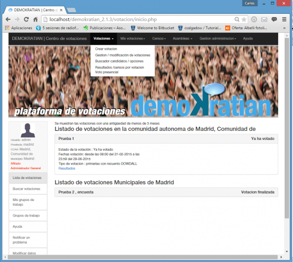

# Disseny Centrat en l'usuari - Disseny d'interfície d'usuari.

# Prototips

Mentre que els wireframes són un «esbós» , els MockUps mostren la «sensació», la textura del disseny, és el prototip el que dóna vida a la «experiència» darrere «de l'experiència de l'usuari».

## Què és un prototip?

Un prototip és un model (representació, demostració o simulació) fàcilment ampliable i modificable d'un sistema planificat, probablement incloent la seua interfície i la seua funcionalitat d'entrades i eixides.

El prototip és una representació d'alt detall d'un projecte digital. En ella es pot identificar i operar:

- Sistemes de navegació
- Paleta de colors aplicada
- Iconografia
- Experiència d'usuari
- Serveis d'ajuda, cerca, interacció.
- Altres elements del projecte

La creació del prototip ha de dur-se a terme quan avaluarem la interacció, i serveix per a definir aspectes que no queden clarament reflectits en un esbós de paper o un wireframe no navegable.

Els prototips són navegables, per la qual cosa serveixen per a testar elements d'interacció com a estats «damunt» de botons, validació de formularis, icones, o qualsevol element amb el qual l'usuari interactue. A través de la creació de prototips, identifiquem i solucionem problemes UX com poden ser la transició des de la pàgina principal als resultats de cerca sense recarregar a l'usuari amb massa informació. Ens serveix com a model del comportament del sistema que pot ser usat per a entendre-ho completament o uns certs aspectes d'ell i així aclarir els requeriments.

Durant la fase de creació de prototips és quan podem fusionar les nostres metes conceptuals amb la nostra realitat pràctica. És quan disseny visual i disseny d'interacció entren en equilibri.

És una fase que pot obviar-se en alguns projectes (si publicaràs un blog o una senzilla pàgina informativa, probablement no necessites un prototip), però si resulta de gran utilitat en uns altres, com a apps, videojocs, grans webs, etc.

Un dels possibles errors a l'hora de llançar un sistema online o aplicació és pensar només en el disseny del model de negoci, el desenvolupament del producte o les vendes. Abans que les nostres aplicacions arriben a les mans dels clients és important que els hàgem provats. Invertir en proves amb usuaris mitjançant prototips ens ajudarà a estalviar temps i costos i sobretot a conéixer si el producte s'adapta a les necessitats dels clients. És el pas previ al desenvolupament i presentació final del projecte. Ens serveix per a identificar, a partir de proves d'usuari (beta-tester), les dificultats del projecte. Això, en el cas de la creació d'aplicacions, apps, startups que estiguen començant el seu projecte, o grans webs , és un avantatge inestimable, ja que permet refinar la interfície sobre la base de dades objectives.

## Prototips, UX, usabilitat i accessibilitat.

Quan ens dediquem al desenvolupament web o de productes interactius, veiem el complicat que resulta aconseguir crear una web o aplicació informàtica que complisca els requisits de UX, usabilitat i accessibilitat, i que a més siga agradable estèticament al client final.

Segons la definició ISO, la usabilitat és «l'eficàcia, l'eficiència i la satisfacció amb la qual els usuaris aconsegueixen uns objectius concrets en un entorn particular» (ISO 9241-11). Un concepte que està lligat a la usabilitat és el d'accessibilitat, el qual no es refereix a la facilitat d'ús, sinó a la possibilitat d'accés. Per a alguns clients és a més un requisit el que l'aplicació ha de ser «usable» per tots els usuaris potencials, sense excloure a aquells amb limitacions individuals. La importància de tots dos termes dependrà del nostre públic objectiu, un disseny accessible implica la necessitat de tindre en compte altres característiques per a fer-lo més universal i heterogeni, mentre que el disseny usable se centra més en uns usuaris concrets. D'altra banda, com déiem anteriorment, l'experiència d'usuari (UX) és el conjunt d'idees, sensacions i valoracions de l'usuari resultat de la interacció amb un producte; és resultat dels objectius de l'usuari, les variables culturals i el disseny de la interfície. Intenta evocar una emoció en l'usuari, és a dir, intenta que l'ús d'un determinat objecte o pàgina web siga satisfactori des d'altres punts de vista més enllà de l'utilitari: estètica, diversió, identificació, etc.

Aquests tres conceptes van molt lligats a la utilitat de crear un prototip i la realització de proves per beta-tester. L'objectiu és aconseguir la major quantitat d'informació possible de la interacció entre l'usuari i el prototip. La seua avaluació assegura que els productes siguen fàcils d'usar i s'ajusten al nostre públic. No cal perdre de vista que el producte serà utilitzat per persones, individus que probablement no se semblen a nosaltres i no tinguen el mateix gust, però volen que el nostre producte funcione. Gràcies a les proves d'usuari amb prototips, serem capaços de detectar problemes i solucionar-los abans del començament de la fase de producció, estalviant així bastants problemes i costos que caldria d'intentar solucionar quan ja està creada tota la programació, o quan s'ha llançat ja el producte. Estalvia hores de desenvolupament, ja que són necessàries menys versions de l'aplicació.

En aquesta fase convé tindre molt en compte els [10 principis de disseny basats en l'usuari](./deuPrincipisNielsen.html), que va definir Jakob Nielsen en 1990 , que continuen sent un referent importantíssim per a avaluar la usabilitat d'un lloc web.

## Caracteristiques del prototip

### Baixa Fidelitat vs. Alta Fidelitat

- **Baixa Fidelitat**: conjunt de dibuixos (per exemple, una presentació d'escenaris) que constitueix una maqueta estàtica, no automatitzada i no operativa d'una interfície d'usuari per a un sistema en planificació.
Alta Fidelitat: conjunt de pantalles que proporcionen un model dinàmic, automatitzat i operatiu d'un sistema en planificació.

### Exploratori vs. Experimental vs. Operacional

- **Exploratori**: prototip no reutilitzable utilitzat per a aclarir les metes del projecte, identificar requeriments, examinar alternatives de disseny o investigar un sistema extens i complex.
- **Experimental**: prototip utilitzat per a la validació d'especificacions de sistema
- **Operacional**: prototip iteratiu que és progressivament refinat fins que es converteix en el sistema final.

### Horitzontal vs. Vertical

- **Horitzontal**: prototip que modela moltes característiques d'un sistema però amb poc detall. Aquest detall aconseguirà una profunditat determinada, resultarà especialment útil en les etapes primerenques de disseny i té com a objectiu el test de la manera d'interacció global, en contemplar funcions comunes que l'usuari utilitzarà sovint.
- **Vertical**: prototip que modela poques característiques d'un sistema però amb molt de detall. Resultarà especialment útil en etapes més avançades del disseny i té com a objectiu el test de detalls del disseny
- **Diagonal**: prototip horitzontal fins a un cert nivell, a partir del qual es pot considerar vertical

### Global vs. Local

- **Global**: prototip del sistema complet. Prototip horitzontal expandit que modela una gran quantitat de característiques i cobreix un ampli rang de funcionalitats. Resultarà molt útil al llarg de tot el procés de disseny.
- **Local**: prototip d'un únic component o característica del sistema d'usabilitat crítica. Resultarà d'utilitat en algunes etapes específiques del procés de disseny.

## Dimensions del prototipat

- **Executabilitat**: serà operatiu el prototip i en aquest cas què significarà això?

    - **Prototip Guiat**: prototip prou operatiu com per a dur a terme una revisió o passeig cognitiu
    - **Prototip d'Animació**: prototip prou operatiu com per a ser executat per parts en manera de presentació en un ordenador
    - **Prototip del Mag de Oz**: prototip que permet ser executat en manera de presentació i la participació d'un tercer subjecte que, ocult a la vista de l'usuari que interactua, gestiona l'evolució de la presentació en funció de les entrades que l'usuari proporciona al sistema
    - **Prototip Interactiu**: operatiu en sentit estricte, s'executa i respon a les entrades que li proporciona l'usuari participant en temps real
    - **Prototip Funcional**: operatiu en sentit estricte, s'executa, respon a les entrades que li proporciona l'usuari participant en temps real i efectua alguna de les operacions que se li sol·liciten

- **Maduració**: es millorarà el prototip per etapes i, en aquest cas, es convertirà en el producte final?

- **Representació**: quin nivell de fidelitat aconseguirà el prototip?

- **Perspectiva**: es limitarà el prototip a àrees específiques de funcionalitat?

## Alguns consells a l'hora de crear un prototip

No hi ha una formula general que puguem aplicar a l'hora de crear un prototip, ja que aquest dependrà de molts factors, però si hi ha algunes coses que podem tindre en compte:

- Cada secció d'una web té un objectiu i aquest ha de quedar clar en veure el prototip.
- Depenent de la mena de prototip, si és d'una web, o d'una aplicació multimèdia, el prototip haurà de ser més o menys complet, en una web senzilla pot tindre només les pàgines més importants que siguen diferents, i en una altra mena d'aplicacions és possible que hàgem de desenvolupar-lo completament.
- És convenient que en la creació del prototip participe també l'equip de disseny. Encara que es pot considerar que és un treball més relacionat amb els equips de desenvolupament, una bona comunicació amb la resta de persones implicades en el producte pot solucionar molts problemes durant la fase de creació del prototip.
- Dissenyar a grandària real, respectar la grandària de les imatges i continguts i incloure l'estructura de navegació.

## Bones pràctiques per la creació de prototips.

A continuació es detallen alguns aspectes a tenir en compter durant el procés de prototipat:
- Utilitzar el prototipat quan els requisits no estiguen clars.
- És important realitzar un prototipat palnificat i controlat.
- Les reunions regulars són vitals per desenrrotllar l'aplicació a temps i evitar retrasos costosos.
- Els usuaris i els dissenyadors deuen estar al tanto dels pronlemes durant la creació dels prototips
- És necessari aprvar un prototip abans de pasar a l'implementació.
- Implementar les caracteístiques importants des del principi per que si s'acaba el temps, s'obtinga un prototip que puga utilitzar-se  perl'implementació.

## Avantatges del prototip

- Els usuaris participen activament en el dessenvolupament. Per tant,, es pot detectar errors en l'etapa inicial del procés de desenrotllament de l'aplicació.
- Es pot identificar les funcions que falten. Ajudant d'aquesta forma a reduir el risc de falles.
- Ajuda als membres del equip de desenvolupament a comunicar-se de forma eficaç.
- Els errors poden detectar-se molt antes.
- Es disposa de retroalimentaciómés ràpida dels usuaris, el que condueix a millors solucions.
- La satisfacció del client existeix perque el client pot sentir l'aplicació en una etapa inicial.
- Apenes hi haurà possibilitat de rebuig de l'aplicació.
- La retroalimentació més ràpida del usuari ajyda a lograr millors solucions de desenvolupament d'aplicacions..
- Permet al client comparar si el codi de l'aplicació coincideix amb l'especificació de la mateixa.
- Permet descobrir fàcilment la funcionalitat o funcionalitats que falten en el sistema.
- Permet identificar els funcions complexes o dificils
- Fomenta la innovació i el disseny flexible.
- Es un model sencill, per lo que és fàcil d'entendre.
- No hi ha necessitat d'experts especialitzats per construir el model.
- El prototip serveix com a base per derivar una especificació de l'aplicació.
- El prototip ajuda a comprendre millor les necessitats del client.
- Els prototips poden ser canviats e inclús descartats.
- Un prototip també serveix com a base per les especificacions operacionals. 
- Els prototips poden oferir una capacitació inicial per els futurs usuaris de l'aplicació.

## Riscos del prototip

- El prototipat pot estimular un número de petició de canvis excessiu
- Els prototips operatius poden induir a pensar a la directiva i als clients que el producte final està pràcticament disposat per a la seua eixida al mercat
- Les característiques del prototip poden conduir a interpretacions errònies de l'usuari-client
- Els clients podrien no estar disposats a participar en el cicle d'iteració durant llargs períodes de temps
- Els desenvolupadors poden trobar dificultats en l'enllestiment de detalls que han resultat de fàcil desenvolupament amb una eina de prototipado
- A causa de les exigències temporals i de mercat, les especificacions del sistema podrien congelar-se abans que el procés de prototipado haja aconseguit una etapa definitiva
- Durant el prototipado, l'única especificació de disseny és el propi prototip, havent d'admetre quantes modificacions siguen necessàries.
- Els prototips en etapes primerenques han de ser de baixa fidelitat
- Els prototips d'alta fidelitat poden ser confosos amb el producte real
- Es corre el risc d'ignorar importants característiques del sistema (actuació, seguretat, robustesa i fiabilitat, p.e.) durant el desenvolupament del prototip
- Pot resultar impossible implementar funcions crítiques del sistema per a la seguretat o l'operació
- La directiva pot trobar problemes en la planificació de la iteració del prototipado
- Els prototips poden albergar simplificacions i imprecisions
- Els prototips poden encarir el producte
- Els prototips de sistemes complexos poden resultar excessivament complicats
- El procés de prototipado és un procés continu que no de deure presentar fases ben definides.
- El procés de prototipado es pot allargar en excés si no s'han establit criteris de conclusió
- El prototipado pot portar als dissenyadors a modificar la seua filosofia de disseny i a l'adopció de models diferents
- El prototipado pot donar poca opció al test de requeriments no funcionals de sistema
- El prototipado es pot estancar si els membres de l'equip de disseny no disposen d'autoritat per a la presa de decisions
- El prototipado pot generar problemes de disciplina
- Les especificacions que sorgeixen durant les últimes etapes del procés de prototipado poden reduir la integritat estructural del sistema, encara parcialment dissenyat
- El context d'ús del prototip pot ser ben diferent del context d'ús del sistema final
- No hi ha garantia que les posicions de desenvolupadors i clients convergisquen durant el cicle d'iteració

## Eines per a la creació de prototips.

Existeixen múltiples maneres de crear un prototip, com comentàvem anteriorment, dependrà molt de la mena d'aplicació que estiguem realitzant, podem des de crear una aplicació pràcticament funcional, usant HTML, CSS, etc. si per exemple estem creant una web, o també podem usar alguna de les aplicacions que existeixen en el mercat per a realitzar un prototip.

A continuació podeu veure una llista d'alguna de les aplicacions més usades

- [Justinmind](http://www.justinmind.com/): Eina professional per a realitzar un prototip de llocs web, aplicacions de programari i aplicacions mòbils. Pot treballar amb Windows o amb Mac.
- [Axure RP](http://www.axure.com/): És una eina de realització de prototips professional que permet crear wireframes per a fer el pre-disseny d'una pàgina web així com MockUps. Disponible tant per a plataforma Windows com Mac. Pots dibuixar tant wireframes estàtics com a interactius que simulen una experiència de navegació de l'usuari real..
- [Balsamiq](http://balsamiq.com/products/mockups/): Amb ella pots fer prototips interactius de webs. Pots usar aquesta eina com un servei web o bé descarregar-la en el teu equip.
- [Protoshare](http://www.protoshare.com/) Està basat en web, i té suport per a twitter bootstrap, a més permet fer simulacions sobre diferent dispositius
- [Jumpchart](https://www.jumpchart.com/): és una aplicació de planificació de webs basades en el navegador la qual possibilita esbossar el contingut de la pàgina web. És possible crear wireframes tant estàtic com interactius que simulen la navegació entre les pàgines web de la maqueta.
- [FlairBuilder](http://www.flairbuilder.com/): eina web que et permet fer esbossos dels teus webs i de les teues Apps per a iPhone. No té possibilitat de col·laborar amb altres persones ni tampoc és possible exportar característiques.
- [iPlotz](http://iplotz.com/): Aquesta eina permet fer maquetes navegables de llocs web i d'aplicacions. Ho pots descarregar en el teu ordinador (Windows/ Mac) o bé pots usar el servei via web.
- [MockFlow](http://www.mockflow.com/): Eina web molt senzilla d'utilitzar per a dissenyar llocs web i aplicacions de programari.
- [Mockingbird](http://gomockingbird.com/): Es tracta d'un servei web gratuït amb el qual es poden fan prototips de pàgines web.
- Si treballes amb l'entorn de programació [Eclipse](http://www.eclipse.org/), pots usar també [WireframeSketcher](http://wireframesketcher.com/), que s'integra dins de l'entorn a la perfecció.
- Quartz composer Eina de disseny que inclou Apple en el seu paquet d'aplicacions per a desenvolupadors.
- [Origami](https://facebook.github.io/origami/) És una eina gratuïta similar a Quartz creada per l'equip de Facebook, que usa Quartz Composer.
- [io](http://proto.io/) et permet crear fàcilment prototips totalment interactius molt fiables que es veuen i funcionen exactament igual que l'aplicació, no requereix saber programar
- [Framerjs](http://framerjs.com/) té l'avantatge que et deixa passar del Photoshop a Framer. Agafa les capes, les exporta i et permet fer interaccions usant javascript.
- [FLINTO](https://www.flinto.com/) És com a POP però et permet fer més coses, i animacions més complexes, tant paraiOS com Android.
- [Pixate](http://www.pixate.com/) És més potent que FLINTO. Et permet animar independentment cada part de la interfície. També té plantilles per a diferents dispositius a les que els pots variar la grandària.

[back](../../metiprot.html)

--------
> *Informació extreta de la web: https://mosaic.uoc.edu*