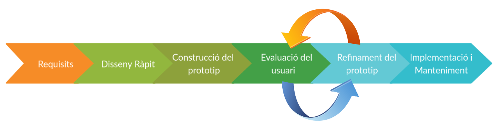

# Disseny Centrat en l'usuari - Disseny d'interfície d'usuari.

# Prototipat

El prototipat d'una aplicació es refereix a la constitució d'un mòdel que mostra la funcionalitat de l'aplicació en el desenrotllament, però en realitat pot no tenir la lògica exacta de l'aplicació original. Es ampliament utilitzat en el desenvolupament d'aplicación ja que compren els requisits del client en una etapa  primerenca del desenvolupament. Podent adaptar-se fàcilment a partir de la retroalimentació del client i facilitant a dissenyadors i dessenrotlladors la comprensió del que s'espera exactament de l'aplicació en desenvolupament, així com els requisits que són especifics de l'usuari i que poden no haver sigut considerats durant el disseny de l'aplicació.

Cap destacar que el prototip és un mòdel de la primera aplicació amb algunes funcionalitatslimitades. Encara que permet als usuaris obtindre una sensació reial de l'aplicació, evaluar-la i provar-la abans de les implementacions. Així, el prototipus té com objectiu proporcionar un mòdel amb una funcionalitat global, però no sol ser complet, obviant molts dels detalls que finalment tindrà l'aplicació.

Un mòdel de protoripus sól implicar les següents fases:

- **Identificació dels requisits bàsics**: Implica la comprensió dels requisits bàsics de l'aplicació, especialment en el que respecta a l'interficie d'usuari. Els detalls més intrincats del disseny intern i els aspectes externs com el rendiment i la seguretat, poden ser ignorats en aquesta etàpa.
- **Disseny ràpit:** consisteix en un disseny preliminar o un disseny ràpit i simple de l'aplicació, donant-li una breu idea del sistema al usuari. Aquest disseny ràpit és el que hem denominat estructura de l'aplicació i és la base per desenvolupar el prototipus.

- **Construcció del prototipat inicial de l'aplicació**: és desenvolupa el prototipo inicial basat en el disseny ràpit, mostrant-se els requisits bàsics i proporcionant les interficies d'usuari. Es possible que aquestes característiques no funcionen exactament de la mateixa manera internament en l'aplicació reial final. Encara que els prototipos provisionals s'utilitzen per mostrar-li al client el mateix aspecte que tindria l'aplicació final.

- **Evaluació de l'usuari**: El prototip és evaluat pel client Aquesta etapa ajuda a descobrir les fortalees i debilitats del mòdel de prototip. La retroalimentació (comentaris i sugerencies) s'arrepleguen de manera que organitzada i s'utilitza per seguir millorant l'aplicació que s'està desenvolupant. De fet, Aquesta fase és repetirà ciclicament fins obtenir un prototupus adequat i poder passar a l'etapa d'implementació.

- **Refinament del prototipus**: S'analitza les observacions i els comentaris de l'avaluació realitzada en el pas anterior i es porta a terme algunes negociacions amb el client sobre la base de factors com les limitacions de temps, presupostos i la viabilitat tècnica de l'aplicació reial. Els canvis acceptats s'incorporen en el nou prototipus i el cicle és repeteix fins que s'acompleixquen tots els requisits especificats per l'usuari. Una vegada que l'usuari està satisfet amb el prototipus desenvolupat, es desarrotlla l'aplicació, basant-se en l'últim prototipus aprovat.

- **Implementació i manteniment**: Una vegada que s'implementa l'aplicació en base al prototipus final, es prova exaustivament i es desplega en producció. L'aplicació es somet a un manteniment rutinari per reduir al mínim el temps d'innactivitat i evitar falles a gran escala.

## Tipus de prototipat

Existeixen diferents tipus de prototipat, encara que els més utilitzats són:

### Prototipat de descart ràpit

També anomenat prototipus d'un sol ús, es basa en utilitzar molt poccs esforsos jynt amb un mínim d'analisis de requeriments per construir el prototip. Per tant, es desenvolupa un prototipus ràpit per mostrar com serà la aplicació visualment. Ante comentaris i sugerencies del client, el prototipo es tira, elaborannt-se un de nou fins que s'alcança un prototipo adecuat. Aquesta tècnica és útil per explotar idees i obtenir retroalimentació instantanea en finció dels requisits del client.

### Prototipat evolutiu.

També anomenat prototip de tauler, es basa en la construcció de prototips funcionals reals amb una funcionalitat mínima al principi. El prototip desenrrotllat forma el cor dels futurs prototips sobre els que es construirà l'aplicació. Al utilitzar el prototipat evolutiu, els requisits ben entesos s'inclouen en el prototipus i els requisits s'afegeixen com forme es van comprenen. Així, el prototip desenvolupat inicialment, es refina gradualment en base a la informació del client fins que és finalment acceptat. Per tant, ajuda a estalviar temps i esforç.

Aquest mòdel és útil per una aplicació o projecte que faça ús d'una nova tecnologia que encara no s'enten molt bé. també s'utilitza per aplicacions complexes on cada funcionalitat deu ser comprovada individualment. És útil quan no s'enten clarament l'etapa inicial.

### Prototip incremental

Es creen multiples prototips fincionals de les diversis parts que integren l'aplicació. Després, s'integren tots els prototipus per formar una aplicació completa.

Aquest mètode és útil per reduir el temps de retroalimentació entre l'usuari i l'equip de desenrotllament de l'aplicació.

###Prototipat extrem.

El mètode de prototipat extrem  s'utiitza principalment per el desenvolupament Web i consisteix en tres fases seqüencials:
El prototip bàsic amb tota la pàgina existent en format HTML
Es  simula el procés de dades utilitzant una capa de serveis de prototip.
els serveis s'implementen i s'integren en el prototip final.

Aquest prototipat s'utilitza per cridar l'atenció sonre la segona fase del procés, en la que es desenrrotlla una interficie d'usuari plenament funcional amb molt poca consideració per els serveis reials.

## Caracteristiques del prototip

### Baixa Fidelitat vs. Alta Fidelitat

- **Baixa Fidelitat**: conjunt de dibuixos (per exemple, una presentació d'escenaris) que constitueix una maqueta estàtica, no automatitzada i no operativa d'una interfície d'usuari per a un sistema en planificació.
Alta Fidelitat: conjunt de pantalles que proporcionen un model dinàmic, automatitzat i operatiu d'un sistema en planificació.

### Exploratori vs. Experimental vs. Operacional

- **Exploratori**: prototip no reutilitzable utilitzat per a aclarir les metes del projecte, identificar requeriments, examinar alternatives de disseny o investigar un sistema extens i complex.
- **Experimental**: prototip utilitzat per a la validació d'especificacions de sistema
- **Operacional**: prototip iteratiu que és progressivament refinat fins que es converteix en el sistema final.

### Horitzontal vs. Vertical

- **Horitzontal**: prototip que modela moltes característiques d'un sistema però amb poc detall. Aquest detall aconseguirà una profunditat determinada, resultarà especialment útil en les etapes primerenques de disseny i té com a objectiu el test de la manera d'interacció global, en contemplar funcions comunes que l'usuari utilitzarà sovint.
- **Vertical**: prototip que modela poques característiques d'un sistema però amb molt de detall. Resultarà especialment útil en etapes més avançades del disseny i té com a objectiu el test de detalls del disseny
- **Diagonal**: prototip horitzontal fins a un cert nivell, a partir del qual es pot considerar vertical

### Global vs. Local

- **Global**: prototip del sistema complet. Prototip horitzontal expandit que modela una gran quantitat de característiques i cobreix un ampli rang de funcionalitats. Resultarà molt útil al llarg de tot el procés de disseny.
- **Local**: prototip d'un únic component o característica del sistema d'usabilitat crítica. Resultarà d'utilitat en algunes etapes específiques del procés de disseny.

## Dimensions del prototipat

Executabilitat: serà operatiu el prototip i en aquest cas què significarà això?

- **Prototip Guiat**: prototip prou operatiu com per a dur a terme una revisió o passeig cognitiu
- **Prototip d'Animació**: prototip prou operatiu com per a ser executat per parts en manera de presentació en un ordenador
- **Prototip del Mag de Oz**: prototip que permet ser executat en manera de presentació i la participació d'un tercer subjecte que, ocult a la vista de l'usuari que interactua, gestiona l'evolució de la presentació en funció de les entrades que l'usuari proporciona al sistema
- **Prototip Interactiu**: operatiu en sentit estricte, s'executa i respon a les entrades que li proporciona l'usuari participant en temps real
- **Prototip Funcional**: operatiu en sentit estricte, s'executa, respon a les entrades que li proporciona l'usuari participant en temps real i efectua alguna de les operacions que se li sol·liciten

Maduració:es millorarà el prototip per etapes i, en aquest cas, es convertirà en el producte final?

Representació:quin nivell de fidelitat aconseguirà el prototip?

Perspectiva:es limitarà el prototip a àrees específiques de funcionalitat?

## Quan utilitzar el prototipat.

Ha d'utilitzar-se quan l'aplicació té molta interacció amb els usuaris finals. Tipicament, els sistemes en línees, les interficies web o les aplicacions mòbils requereixen una gran interacció amb els usuaris finals. Per lo tant són els més adequats pel prototipat.

Cap destacar que la creació d'un prototip garanteix que els usuaris finals treballen constantment amb l'aplicació i proporcionen una retroalimentació que s'incorpora al prototip per donar lloc a una aplicació utilitzable.

### Bones pràctiques per la creació de prototips.

A continuació es detallen alguns aspectes a tenir en compter durant el procés de prototipat:
- Utilitzar el prototipat quan els requisits no estiguen clars.
- És important realitzar un prototipat palnificat i controlat.
- Les reunions regulars són vitals per desenrrotllar l'aplicació a temps i evitar retrasos costosos.
- Els usuaris i els dissenyadors deuen estar al tanto dels pronlemes durant la creació dels prototips
- És necessari aprvar un prototip abans de pasar a l'implementació.
- Implementar les caracteístiques importants des del principi per que si s'acaba el temps, s'obtinga un prototip que puga utilitzar-se  perl'implementació.

### Avantatges del prototip

- Els usuaris participen activament en el dessenvolupament. Per tant,, es pot detectar errors en l'etapa inicial del procés de desenrotllament de l'aplicació.
- Es pot identificar les funcions que falten. Ajudant d'aquesta forma a reduir el risc de falles.
- Ajuda als membres del equip de desenvolupament a comunicar-se de forma eficaç.
- Els errors poden detectar-se molt antes.
- Es disposa de retroalimentaciómés ràpida dels usuaris, el que condueix a millors solucions.
- La satisfacció del client existeix perque el client pot sentir l'aplicació en una etapa inicial.
- Apenes hi haurà possibilitat de rebuig de l'aplicació.
- La retroalimentació més ràpida del usuari ajyda a lograr millors solucions de desenvolupament d'aplicacions..
- Permet al client comparar si el codi de l'aplicació coincideix amb l'especificació de la mateixa.
- Permet descobrir fàcilment la funcionalitat o funcionalitats que falten en el sistema.
- Permet identificar els funcions complexes o dificils
- Fomenta la innovació i el disseny flexible.
- Es un model sencill, per lo que és fàcil d'entendre.
- No hi ha necessitat d'experts especialitzats per construir el model.
- El prototip serveix com a base per derivar una especificació de l'aplicació.
- El prototip ajuda a comprendre millor les necessitats del client.
- Els prototips poden ser canviats e inclús descartats.
- Un prototip també serveix com a base per les especificacions operacionals. 
- Els prototips poden oferir una capacitació inicial per els futurs usuaris de l'aplicació.

### Riscos del prototip

- El prototipat pot estimular un número de petició de canvis excessiu
- Els prototips operatius poden induir a pensar a la directiva i als clients que el producte final està pràcticament disposat per a la seua eixida al mercat
- Les característiques del prototip poden conduir a interpretacions errònies de l'usuari-client
- Els clients podrien no estar disposats a participar en el cicle d'iteració durant llargs períodes de temps
- Els desenvolupadors poden trobar dificultats en l'enllestiment de detalls que han resultat de fàcil desenvolupament amb una eina de prototipado
- A causa de les exigències temporals i de mercat, les especificacions del sistema podrien congelar-se abans que el procés de prototipado haja aconseguit una etapa definitiva
- Durant el prototipado, l'única especificació de disseny és el propi prototip, havent d'admetre quantes modificacions siguen necessàries.
- Els prototips en etapes primerenques han de ser de baixa fidelitat
- Els prototips d'alta fidelitat poden ser confosos amb el producte real
- Es corre el risc d'ignorar importants característiques del sistema (actuació, seguretat, robustesa i fiabilitat, p.e.) durant el desenvolupament del prototip
- Pot resultar impossible implementar funcions crítiques del sistema per a la seguretat o l'operació
- La directiva pot trobar problemes en la planificació de la iteració del prototipado
- Els prototips poden albergar simplificacions i imprecisions
- Els prototips poden encarir el producte
- Els prototips de sistemes complexos poden resultar excessivament complicats
- El procés de prototipado és un procés continu que no de deure presentar fases ben definides.
- El procés de prototipado es pot allargar en excés si no s'han establit criteris de conclusió
- El prototipado pot portar als dissenyadors a modificar la seua filosofia de disseny i a l'adopció de models diferents
- El prototipado pot donar poca opció al test de requeriments no funcionals de sistema
- El prototipado es pot estancar si els membres de l'equip de disseny no disposen d'autoritat per a la presa de decisions
- El prototipado pot generar problemes de disciplina
- Les especificacions que sorgeixen durant les últimes etapes del procés de prototipado poden reduir la integritat estructural del sistema, encara parcialment dissenyat
- El context d'ús del prototip pot ser ben diferent del context d'ús del sistema final
- No hi ha garantia que les posicions de desenvolupadors i clients convergisquen durant el cicle d'iteració
**

[back](../../metiprot.html)