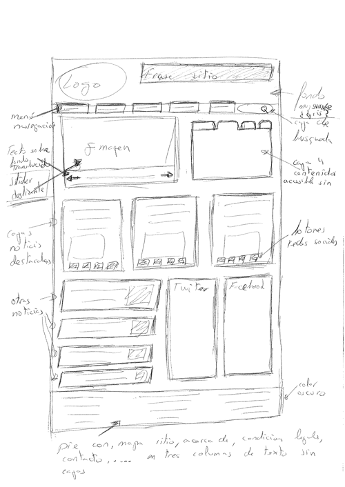

# Disseny Centrat en l'usuari - Disseny d'interfície d'usuari.

# Sketch

Pensem en el Sketch com un primer esbós que realitzem per a un projecte digital que volem crear. Són els nostres primers traços sobre un full de paper.

Actualment passem bona part del nostre temps enfront d'un monitor, no obstant això enmig d'aquesta era digital, els millors aliats d'un dissenyador de pàgines web o aplicacions són eines molt més senzilles i comunes, ens referim al llapis i paper, una part del procés creatiu que altres dissenyadors «no digitals» han estat utilitzant des de sempre, dibuixar.

La clau per als bons esbossos és simplement deixar-se portar, jugar amb elements del disseny com la forma en què els menús podrien aparéixer, o com fer que aparega una característica per a una part en particular del contingut. Si parlem amb diferents dissenyadors, la majoria d'ells et diran que una part enorme del seu flux de treball és esbossar en primer lloc qualsevol idea que puguen tindre. Aquest procés no té un treball conceptual molt extens, prima la creativitat, l'experiència i el desig del dissenyador.

El Sketch ha de reflectir les idees generals sobre el projecte, ha de respondre entre altres qüestions a: 

- On posarem els elements més característics com a logos, etc.
- On estarà la zona de navegació
- On es carreguen els sistemes d'ajuda per a usuaris
- S'agregaran serveis de xarxes socials
- Quines àrees de continguts i que servei volem presentar en el projecte

 

### Consells a l'hora de crear un sketch

Agafa un llapis i paper i comença a jugar amb idees i esbossos. L'objectiu principal del dibuix és aconseguir idees de treball i explorar qualsevol proposta que cregues puga arribar a més. El millor que pots fer amb el dibuix és experimentar, no importa cometre un error, o que alguna cosa no es veja bé, estem en un moment inicial i no hem de tindre por de descartar-lo i passar al següent esbós. Realment, com més temps passem jugant amb les idees i veient com es poden millorar, o si han de ser millorades, començarem a veure el que fa que una bona idea ho siga.

Una de les millors coses que es pot fer amb un dibuix és documentar i escriure sobre el que hem fet. Això és tan fàcil com escriure en els laterals xicotets comentaris amb una mica d'informació sobre el que hem fet.

Pensa que potser una idea que hem descartat per a un projecte en concret, pot servir-nos per a un altre projecte i aquestes anotacions ens vindran molt bé. Fins i tot és possible que estiguem diversos dies treballant sobre una idea, això també ens resultara útil per a recordar perquè afegim algun element en un sketch.

Anar a [WireFrame](./wireframe.html)

[back](../../metiprot.html)

--------
> *Informació extreta de la web: https://mosaic.uoc.edu*