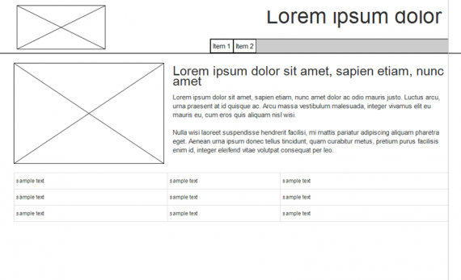
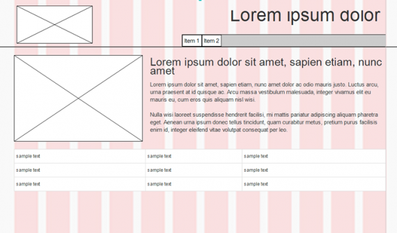
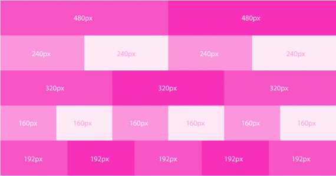
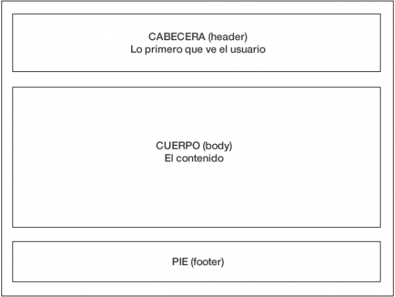
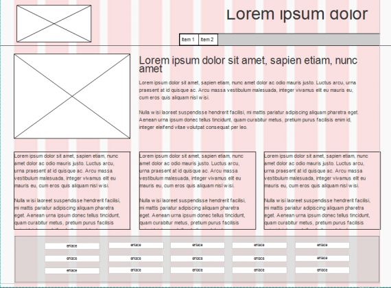
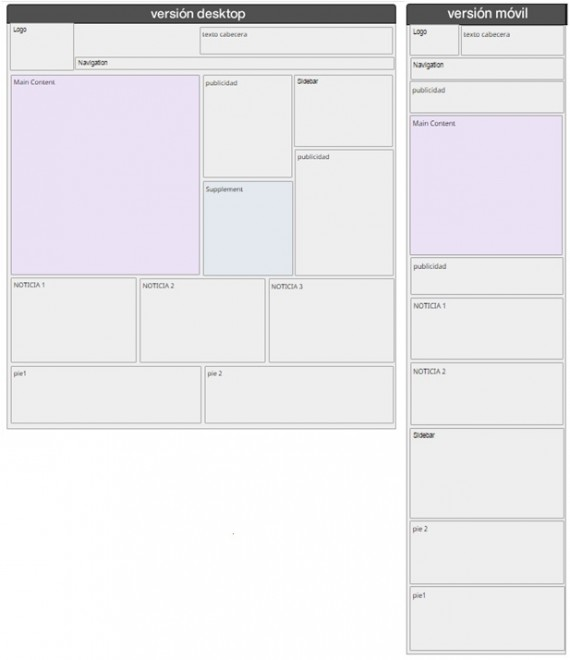

# Disseny Centrat en l'usuari - Disseny d'interfície d'usuari.

# Wireframe

El següent pas des del punt de vista del disseny gràfic i arquitectura d'informació en un projecte digital és la creació dels wireframe donant-nos suport en el sketch que hem dibuixat.

## Què és un Wireframe?

Wireframe és una paraula anglesa que significa «filferro» la qual cosa ja ens dóna bastant pistes de què ens estem referint, és per tant; una il·lustració bidimensional de la interfície d'una pàgina o una aplicació que es centra específicament en l'assignació d'espai i priorització del contingut, les funcionalitats disponibles, i els comportaments desitjats. Per aquestes raons, els wireframes normalment manquen d'estil tipogràfic, color o aplicacions gràfiques, ja que el seu principal objectiu resideix en la funcionalitat, comportament i jerarquia de continguts. En altres paraules, se centra en “què fa la pantalla, no com es veu”. Els wireframes també ens ajuden a establir relacions entre les diferents plantilles d'un lloc web o aplicació.

El wireframe connecta l'estructura conceptual, o arquitectura de la informació, amb el disseny visual de la web o aplicació. Ajuden a establir la funcionalitat, i les relacions entre les diferents plantilles de pantalles.

És per tant un pas important en qualsevol procés de disseny d'una pantalla. Mitjançant aquest procés podem sobretot definir la jerarquia de la informació del nostre disseny, per la qual cosa resulta més fàcil planificar el disseny d'acord amb com volem que un usuari processe la informació.

 

Els wireframes serveixen per a múltiples propòsits, ajudant a:

- Donar prioritat als continguts determinant la quantitat d'espai que es va assignar a un element donat i on es troba aqueix element.
- Connectar arquitectura de la informació del lloc per al seu disseny visual, mostrant les connexions entre les pàgines.
- Aclarir els espais i formes per a la visualització de determinats tipus d'informació sobre la interfície d'usuari.
- Determinar la funcionalitat prevista en la interfície, la quantitat de les funcions disponibles, o l'efecte dels diferents escenaris en la pantalla.

## Consells a l'hora de crear un Wireframe

És important tindre en compte que els wireframes són guies dels principals elements de navegació i contingut de la seua pàgina o aplicació i que l'objectiu no és representar el disseny visual, per tant;

- No utilitzar colors. Es recomana usar diferents tons de grisos si volem fer distincions entre diferents elements.
- No utilitzar imatges ni iconografia. Les imatges distrauen de la tasca per a la qual serveix un wireframe, per exemple, per a indicar on es col·locarà una imatge i la seua grandària, se sol posar una caixa amb una creu que el creue amb la grandària i la posició on volem situar la imatge
- Utilitzar només una tipografia genèrica, encara que es pot jugar amb diferents grandàries per a indicar diverses capçaleres i els canvis en la jerarquia de la informació dels textos de la pàgina.
- Encara que wireframes difereixen dels uns als altres, els següents elements solen ser habituals quan estem creant un wireframe per a una pàgina web.
    - Logo
    - Camp de cerca
    - Capçaleres, incloent títol de la pàgina com l'H1 i H2, subtítols…
    - Els sistemes de navegació, incloent navegació global i navegació local
    - Contingut del cos
    - Botons de compartir
    - Informació de contacte
    - Peu de pàgina

## Wireframe i reixetes

En el context del disseny gràfic un reticle, grilla o reixeta és un instrument per a ordenar els elements gràfics com el text i les imatges.

Encara que a primera vista es pot pensar que dissenyar amb reixetes limita la creativitat això no és així. El maquetat mitjançant grids, «reixetes» és una tècnica que ens pot ajudar i pot reduir considerablement el nostre treball, sí que és veritat que les primeres vegades ens poden costar una mica entendre les raons per a usar-lo, però una vegada que ens acostumem a manejar-lo, el flux de treball serà molt més ràpid.

Una reixeta es desenvolupa a partir de la grandària de la pàgina o del nostre disseny, la seua funció és subdividir l'espai en camps i intervals, i el seu objectiu és mantindre una col·locació correcta dels element dins de la pàgina, donant una sensació d'estructura ordenada.

En el disseny editorial, per exemple, la mesura del reticle s'establirà a partir de les variables tipogràfiques: la família, la font, el cos, la mesura de línia i la interlínea, no obstant això en el disseny de pàgines web o aplicacions que es visualitzaran en un monitor és habitual usar el nombre màgic de 960px . Matemàticament és molt simple, 960 és divisible per 1, 2, 3, 4, 5, 6 i 12 permetent que tingues múltiples configuracions i nombres de columnes en els teus dissenys.

 

En el disseny de pàgines web l'ús de la reixeta de 960px amb 12 columnes s'ha popularitzat tant que alguns dels més importants frameworks de desenvolupament de pàgines web responsive com són Twitter Bootstrap o 960 GRID system usen aquesta configuració de columnes i en molts dels programes per a crear wireframes trobàreu l'opció per a poder dissenyar amb aquesta mena de reixetes.

 

## Disseny amb Caixes

Com hem vist, els wireframes tenen entre altres , la funció d'estructurar i jerarquitzar els continguts. Pensem llavors en l'ordre de la informació que ens agradaria presentar als visitants, de dalt a baix és el més fàcil, i en segon lloc d'esquerra a dreta. A més, en el cas de les pàgines web, una estructura bàsica molt comuna és dividir la pàgina en tres zones, capçalera, cos, i peu.

 

Un exemple d'una portada d'una pàgina web que ens podem trobar de manera habitual podria ser la següent

Habitualment usarem aquesta estructura bàsica de capçalera, cos i peu, encara que moltes vegades podem ser creatius amb el disseny, depenent del nostre objectiu i d'allò que estiguem dissenyant, i mantindre la jerarquia de la informació en la ment.

-----
 

 

En els exemples anteriors trobem un wireframe amb múltiples contenidors per a diferents tipus de continguts com a publicitat, diferents serveis, etc. perfectament ordenats

------

### Definir la informació de la jerarquia amb la tipografia

Quan ja tenim definida l'estructura amb les nostres caixes perfectament posicionades, hem de veure si tenim correctament estructurada la informació. La regla bàsica que devem de tindre en compte és que la informació que es desitja oferir al públic ha de ser clara, fins i tot en una estructura metàl·lica en blanc i negre.

Utilitzant diferents grandàries de font, negretes, i/o subratllats resulta una bona fórmula per a diferenciar entre els diferents nivells d'informació.

-----------

 

Com en altres ocasions, no hem de tindre por d'experimentar en aquesta etapa, a vegades, a mesura que omplim amb més detalls, podem adonar-nos que la disposició original no està funcionant bé, i haurem de fer els canvis necessaris per a trobar la millor manera de representar la informació que estem tractant de comunicar.

-----------

###  wireframes i web responsive.

A conseqüència de la proliferació de telèfons intel·ligents i tauletes en el mercat actual, existeix més diversitat que mai de formats de pantalla, per la qual cosa cada vegada més, ens sorgeix la necessitat que la nostra web, o aplicació s'adapte a les diferents grandàries d'aquests.

El disseny web responsive o adaptatiu és una tècnica de disseny web que busca la correcta visualització d'una mateixa pàgina en diferents dispositius. Des d'ordinadors d'escriptori a tauletes i mòbils. Es tracta de redimensionar i col·locar els elements de la web de manera que s'adapten a l'ample de cada dispositiu permetent una correcta visualització i una millor experiència per a l'usuari.

Ara hem de dissenyar i pensar responsive. Els nostres dissenys, les nostres pàgines o aplicacions han d'encaixar correctament en el dispositiu que estiga usant l'usuari.

A més, les estadístiques sobre la navegació mòbil, indiquen que prompte tindran accés a la web i a les diferents aplicacions més persones des del mòbil que des d'un ordinador pel que hem de pensar des del principi en això per a qualsevol nou lloc que dissenyem.

Això presenta un nou repte. Si crearem el wireframes dels dissenys de les nostres aplicacions, llavors hem de pensar i, per tant, crear els wireframes de manera polimòrfica, és a dir, sabent que canviarà la forma en diferents situacions.

Per exemple, quan creem un disseny d'una aplicació amb ample fix-escriptori (ordinador amb pantalla convencional) si ho entreguem a un desenvolupador per a crear la interface o l'HTML / CSS si és una web, estem demanant als desenvolupadors que prenguen un munt de decisions, possiblement de disseny sense que ells si més no s'adonen.

Com ha d'ajustar-se el disseny per als dispositius de menor grandària? quin serà la jerarquia dels elements de la pàgina?quals són més importants en funció del seu objectiu?I quina és la jerarquia dels continguts?Com funciona la navegació en pantalles més xicotetes?Com manege el menú amb un dispositiu de 320 × 480 tàctil ?

En considerar i afegir elements per al que és bàsicament el model per al nostre disseny, hem d'assegurar-nos que tot pot transformar-se de forma visualment agradable a les resolucions més altes i/o més baixes. Canviant el disseny com siga necessari, fent ús de resolucions més àmplies amb més eficàcia i, possiblement utilitzant l'omissió d'alguns dels continguts a resolucions més baixes (un últim recurs, per descomptat).

El disseny responsive permet reduir el temps de desenvolupament, evita els continguts duplicats, i augmenta la viralitat dels continguts ja que permet compartir-los d'una forma molt més ràpida i natural.

Molts autors apunten al fet que per a crear un wireframe responsive convé començar pels «amples estrets» o «mòbil primer» per a garantir que podem servir el nostre contingut al mínim comú denominador i ampliar aquest progressivament a mesura que es dispose de més resolució per a treballar amb les pantalles més àmplies, encara que sobre aquesta manera de treballar hi ha detractors. No obstant això la forma que sembla més habitual és conéixer quin serà el públic objecte de la nostra aplicació i quin tipus de dispositius s'usaran majoritàriament, per a després adaptar el nostre disseny a la resta de grandàries.

A partir d'ara hem de desconstruir mentalment la nostra aplicació a l'hora de crear els nostres wireframes, dividint-ho mentalment en columnes i elements. No sols pot existir una columna al costat d'una altra, sinó que també un element per damunt o per davall depenent de l'ample del dispositiu. Hem de canviar molts dels estàndards comunament aplicats en el disseny d'aplicacions per a ordinadors , per exemple en una pàgina web per a mòbil, en realitat només hi ha 2 zones importants, l'encapçalat i el peu de pàgina, els quals hauran de portar les opcions de navegació més importants.

Per naturalesa, un enfocament de mòbil de grandària és estret i té més força el disseny en una sola columna. La columna única, al seu torn, provoca una visualització lineal dels continguts i característiques..

A l'hora de crear els nostres wireframes, com hem vist anteriorment, l'ús de reixetes, juntament amb el disseny amb columnes, ens facilitarà a l'hora de dissenyar per a aconseguir que la nostra aplicació siga responsive.

-----

 

Es tracta de proporcionar a tots els usuaris d'una web o una aplicació els mateixos continguts i una experiència d'usuari el més similar possible independentment de la grandària de la pantalla del dispositiu que utilitze.

-------

## Eines per a crear wireframes

Existeixen multitud d'eines gratuïtes o de pagament per a realitzar wireframes, moltes d'elles a més permeten realitzar també MockUps, en aquesta secció inclourem les més interessants, encara que les que permeten totes dues funcions les veurem en la següent part.

- [Gliffi](https://www.gliffy.com/uses/wireframe-software) Programa de dibuix online que té una utilitat per a fer wireframes, té un avantatge i és que permet el treball col·laboratiu online i a més fa possible també realitzar esquemes per a crear els mapes web
- [Cacoo](https://cacoo.com/) és una eina de dibuix en línia fàcil d'usar que et permet crear una varietat de diagrames, com a mapes de lloc, wireframes i gràfics de la xarxa.
- [Mockingbird](https://gomockingbird.com/) També és un programari basat en web per a crear, i compartir wireframes un lloc web o una aplicació. Aquest programari està més especifique per a la creació de wireframes i permet l'ús de reixetes de 960px
- [Lumzy](http://lumzy.com/) També basat en edició web, té la possibilitat de carregar llibreries, a més permet crear accions per a botons i alguns altres elements.
- [Framebox](http://framebox.org/) Es tracta també d'una eina web molt senzilla
- [RWD](http://www.lifeishao.com/rwdwire) Wireframes Interessant eina que permet fer wireframes senzills podent treballar amb ells per a crear web responsive

Com és obvi, també podem usar qualsevol programa de dibuix, ja siga vectorial com a Il·lustrador o Inkscape, o programes més orientats al retoc d'imatges com Photoshop o Fireworks. En el cas d'aquesta mena de programes podem trobar múltiples plantilles que podrem importar amb aquests programes i que ens serviran d'ajuda.

Anar a [Mockup](./mockup.html)

[back](../../metiprot.html)

--------
> *Informació extreta de la web: https://mosaic.uoc.edu*