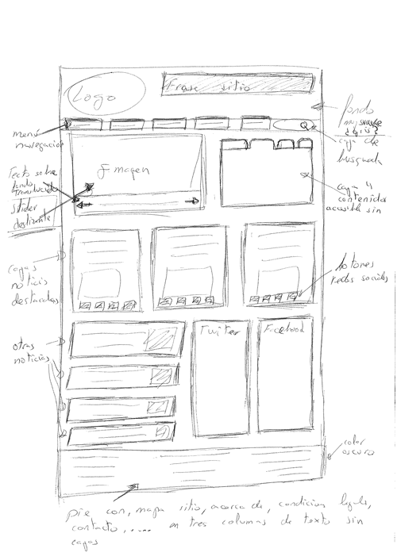
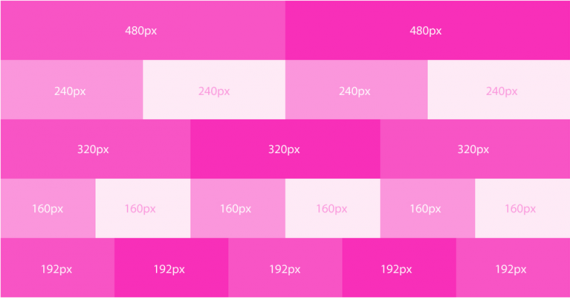
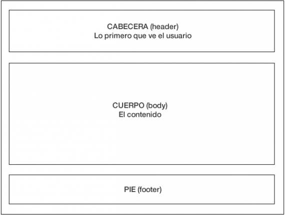
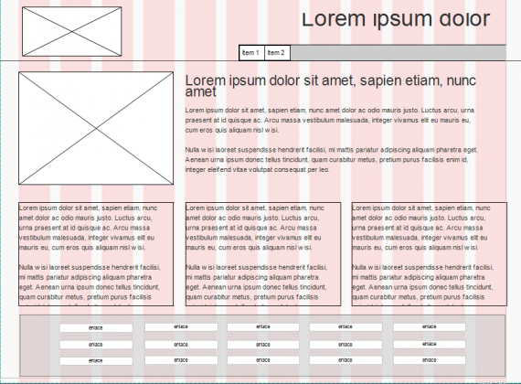
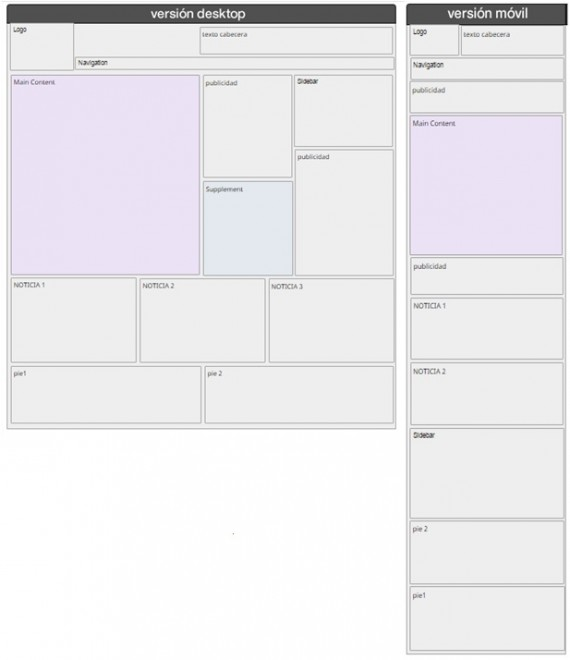
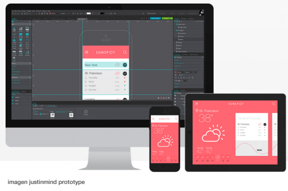
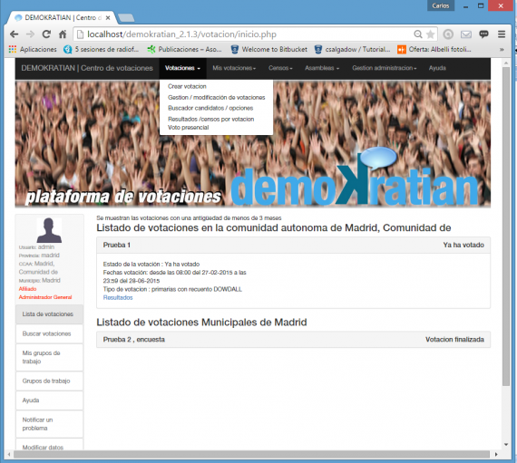

# Disseny Centrat en l'usuari - Disseny d'interfície d'usuari.

# Sketchs, mockups, wireframes i prototips

## Introducció

Abans de res, veurem què és i que no és un sketch, un wireframe , un mockup i un prototip, conceptes sobre els quals hi ha prou confusió i no han de ser confosos els uns amb els altres i sobre els quals és complicat trobar informació precisa. Aquesta confusió és especialment rellevant entre wireframe i mockup ja que molts programes d'ajuda en el disseny permeten fer totes dues activitats en el mateix programa. No sols hi ha diferències conceptuals entre els uns i els altres, sinó que també cal tindre en compte poden existir repercussions econòmiques en un projecte, ja que utilitzar l'un o l'altre influeix en la quantitat d'hores d'invertides en el desenvolupament/dissenye i per tant incrementar els costos associats.

Tots aquests passos són part integral del procés de disseny UX, i així a cadascun cal donar-li la deguda atenció

Abans de passar a la fase de desenvolupament d'un lloc web o aplicació, convé passar per aquestes etapes preliminars. Aquestes etapes també permeten a l'equip de treball i, a vegades, per a grans projectes, que alguns usuaris o els denominats beta-tester posen a prova l'aparença, estructura i funcionalitat abans del seu llançament.

L'ideal és que aquestes etapes preliminars permeten trobar qualsevol problema mentre està encara en fase inicial i afinar així el seu disseny, estructura o funcionalitat, per a comunicar el seu missatge amb més claredat.

Abans de continuar, cal aclarir el significat de UX, encara que és alguna cosa conegut pels dissenyadors, no ho és tant per les persones que s'estan iniciant en aquest sector.

Trobar una definició consensuada per a UX o experiència d'usuari (User experience ), no resulta fàcil. Per a Arhippainen i Tähti l'Experiència de l'Usuari és senzillament com l'experiència que obté l'usuari quan interactua amb un producte en condicions particulars. No obstant això Knapp Bjerén la defineix com «el conjunt d'idees, sensacions i valoracions de l'usuari resultat de la interacció amb un producte; és resultat dels objectius de l'usuari, les variables culturals i el disseny de la interfície».

## Fases de desenvolupament d'un lloc web o aplicació

En el desenvolupament de productes i/o aplicacions, ja siguen per a la web , com una altra mena d'aplicacions informàtiques, hi ha una sèrie de fases que convé seguir, encara que molts professionals, en funció de la mena de projecte poden obviar alguna o poden fer més o menys recalcament en alguna fase. De manera general els passos a seguir seran:

- Realització d'un sketch
- Creació d'un wireframe
- Un mockup
- Finalment realitzar un prototip

 

Aquests passos ens ajuden a posar en ordre les nostres idees, explorar diferents camins de concepte o disseny i detectar possibles errors o problemes.

## Què és un Sketch?

Pensem en el Sketch com un primer esbós que realitzem per a un projecte digital que volem crear. Són els nostres primers traços sobre un full de paper.

Actualment passem bona part del nostre temps enfront d'un monitor, no obstant això enmig d'aquesta era digital, els millors aliats d'un dissenyador de pàgines web o aplicacions són eines molt més senzilles i comunes, ens referim al llapis i paper, una part del procés creatiu que altres dissenyadors «no digitals» han estat utilitzant des de sempre, dibuixar.

La clau per als bons esbossos és simplement deixar-se portar, jugar amb elements del disseny com la forma en què els menús podrien aparéixer, o com fer que aparega una característica per a una part en particular del contingut. Si parlem amb diferents dissenyadors, la majoria d'ells et diran que una part enorme del seu flux de treball és esbossar en primer lloc qualsevol idea que puguen tindre. Aquest procés no té un treball conceptual molt extens, prima la creativitat, l'experiència i el desig del dissenyador.

El Sketch ha de reflectir les idees generals sobre el projecte, ha de respondre entre altres qüestions a: 

- On posarem els elements més característics com a logos, etc.
- On estarà la zona de navegació
- On es carreguen els sistemes d'ajuda per a usuaris
- S'agregaran serveis de xarxes socials
- Quines àrees de continguts i que servei volem presentar en el projecte

 

### Consells a l'hora de crear un sketch

Agafa un llapis i paper i comença a jugar amb idees i esbossos. L'objectiu principal del dibuix és aconseguir idees de treball i explorar qualsevol proposta que cregues puga arribar a més. El millor que pots fer amb el dibuix és experimentar, no importa cometre un error, o que alguna cosa no es veja bé, estem en un moment inicial i no hem de tindre por de descartar-lo i passar al següent esbós. Realment, com més temps passem jugant amb les idees i veient com es poden millorar, o si han de ser millorades, començarem a veure el que fa que una bona idea ho siga.

Una de les millors coses que es pot fer amb un dibuix és documentar i escriure sobre el que hem fet. Això és tan fàcil com escriure en els laterals xicotets comentaris amb una mica d'informació sobre el que hem fet.

Pensa que potser una idea que hem descartat per a un projecte en concret, pot servir-nos per a un altre projecte i aquestes anotacions ens vindran molt bé. Fins i tot és possible que estiguem diversos dies treballant sobre una idea, això també ens resultara útil per a recordar perquè afegim algun element en un sketch.

## Wireframe

El següent pas des del punt de vista del disseny gràfic i arquitectura d'informació en un projecte digital és la creació dels wireframe donant-nos suport en el sketch que hem dibuixat.

Què és un Wireframe?

Wireframe és una paraula anglesa que significa «filferro» la qual cosa ja ens dóna bastant pistes de què ens estem referint, és per tant; una il·lustració bidimensional de la interfície d'una pàgina o una aplicació que es centra específicament en l'assignació d'espai i priorització del contingut, les funcionalitats disponibles, i els comportaments desitjats. Per aquestes raons, els wireframes normalment manquen d'estil tipogràfic, color o aplicacions gràfiques, ja que el seu principal objectiu resideix en la funcionalitat, comportament i jerarquia de continguts. En altres paraules, se centra en “què fa la pantalla, no com es veu”. Els wireframes també ens ajuden a establir relacions entre les diferents plantilles d'un lloc web o aplicació.

El wireframe connecta l'estructura conceptual, o arquitectura de la informació, amb el disseny visual de la web o aplicació. Ajuden a establir la funcionalitat, i les relacions entre les diferents plantilles de pantalles.

És per tant un pas important en qualsevol procés de disseny d'una pantalla. Mitjançant aquest procés podem sobretot definir la jerarquia de la informació del nostre disseny, per la qual cosa resulta més fàcil planificar el disseny d'acord amb com volem que un usuari processe la informació.

 

Els wireframes serveixen per a múltiples propòsits, ajudant a:

- Donar prioritat als continguts determinant la quantitat d'espai que es va assignar a un element donat i on es troba aqueix element.
- Connectar arquitectura de la informació del lloc per al seu disseny visual, mostrant les connexions entre les pàgines.
- Aclarir els espais i formes per a la visualització de determinats tipus d'informació sobre la interfície d'usuari.
- Determinar la funcionalitat prevista en la interfície, la quantitat de les funcions disponibles, o l'efecte dels diferents escenaris en la pantalla.

### Consells a l'hora de crear un Wireframe

És important tindre en compte que els wireframes són guies dels principals elements de navegació i contingut de la seua pàgina o aplicació i que l'objectiu no és representar el disseny visual, per tant;

- No utilitzar colors. Es recomana usar diferents tons de grisos si volem fer distincions entre diferents elements.
- No utilitzar imatges ni iconografia. Les imatges distrauen de la tasca per a la qual serveix un wireframe, per exemple, per a indicar on es col·locarà una imatge i la seua grandària, se sol posar una caixa amb una creu que el creue amb la grandària i la posició on volem situar la imatge
- Utilitzar només una tipografia genèrica, encara que es pot jugar amb diferents grandàries per a indicar diverses capçaleres i els canvis en la jerarquia de la informació dels textos de la pàgina.
- Encara que wireframes difereixen dels uns als altres, els següents elements solen ser habituals quan estem creant un wireframe per a una pàgina web.
    - Logo
    - Camp de cerca
    - Capçaleres, incloent títol de la pàgina com l'H1 i H2, subtítols…
    - Els sistemes de navegació, incloent navegació global i navegació local
    - Contingut del cos
    - Botons de compartir
    - Informació de contacte
    - Peu de pàgina

### Wireframe i reixetes

En el context del disseny gràfic un reticle, grilla o reixeta és un instrument per a ordenar els elements gràfics com el text i les imatges.

Encara que a primera vista es pot pensar que dissenyar amb reixetes limita la creativitat això no és així. El maquetat mitjançant grids, «reixetes» és una tècnica que ens pot ajudar i pot reduir considerablement el nostre treball, sí que és veritat que les primeres vegades ens poden costar una mica entendre les raons per a usar-lo, però una vegada que ens acostumem a manejar-lo, el flux de treball serà molt més ràpid.

Una reixeta es desenvolupa a partir de la grandària de la pàgina o del nostre disseny, la seua funció és subdividir l'espai en camps i intervals, i el seu objectiu és mantindre una col·locació correcta dels element dins de la pàgina, donant una sensació d'estructura ordenada.

En el disseny editorial, per exemple, la mesura del reticle s'establirà a partir de les variables tipogràfiques: la família, la font, el cos, la mesura de línia i la interlínea, no obstant això en el disseny de pàgines web o aplicacions que es visualitzaran en un monitor és habitual usar el nombre màgic de 960px . Matemàticament és molt simple, 960 és divisible per 1, 2, 3, 4, 5, 6 i 12 permetent que tingues múltiples configuracions i nombres de columnes en els teus dissenys.

 

En el disseny de pàgines web l'ús de la reixeta de 960px amb 12 columnes s'ha popularitzat tant que alguns dels més importants frameworks de desenvolupament de pàgines web responsive com són Twitter Bootstrap o 960 GRID system usen aquesta configuració de columnes i en molts dels programes per a crear wireframes trobàreu l'opció per a poder dissenyar amb aquesta mena de reixetes.

 

### Disseny amb Caixes

Com hem vist, els wireframes tenen entre altres , la funció d'estructurar i jerarquitzar els continguts. Pensem llavors en l'ordre de la informació que ens agradaria presentar als visitants, de dalt a baix és el més fàcil, i en segon lloc d'esquerra a dreta. A més, en el cas de les pàgines web, una estructura bàsica molt comuna és dividir la pàgina en tres zones, capçalera, cos, i peu.

 

Un exemple d'una portada d'una pàgina web que ens podem trobar de manera habitual podria ser la següent

Habitualment usarem aquesta estructura bàsica de capçalera, cos i peu, encara que moltes vegades podem ser creatius amb el disseny, depenent del nostre objectiu i d'allò que estiguem dissenyant, i mantindre la jerarquia de la informació en la ment.

-----
 

 

En els exemples anteriors trobem un wireframe amb múltiples contenidors per a diferents tipus de continguts com a publicitat, diferents serveis, etc. perfectament ordenats

------

#### Definir la informació de la jerarquia amb la tipografia

Quan ja tenim definida l'estructura amb les nostres caixes perfectament posicionades, hem de veure si tenim correctament estructurada la informació. La regla bàsica que devem de tindre en compte és que la informació que es desitja oferir al públic ha de ser clara, fins i tot en una estructura metàl·lica en blanc i negre.

Utilitzant diferents grandàries de font, negretes, i/o subratllats resulta una bona fórmula per a diferenciar entre els diferents nivells d'informació.

-----------

 

Com en altres ocasions, no hem de tindre por d'experimentar en aquesta etapa, a vegades, a mesura que omplim amb més detalls, podem adonar-nos que la disposició original no està funcionant bé, i haurem de fer els canvis necessaris per a trobar la millor manera de representar la informació que estem tractant de comunicar.

-----------

####  wireframes i web responsive.

A conseqüència de la proliferació de telèfons intel·ligents i tauletes en el mercat actual, existeix més diversitat que mai de formats de pantalla, per la qual cosa cada vegada més, ens sorgeix la necessitat que la nostra web, o aplicació s'adapte a les diferents grandàries d'aquests.

El disseny web responsive o adaptatiu és una tècnica de disseny web que busca la correcta visualització d'una mateixa pàgina en diferents dispositius. Des d'ordinadors d'escriptori a tauletes i mòbils. Es tracta de redimensionar i col·locar els elements de la web de manera que s'adapten a l'ample de cada dispositiu permetent una correcta visualització i una millor experiència per a l'usuari.

Ara hem de dissenyar i pensar responsive. Els nostres dissenys, les nostres pàgines o aplicacions han d'encaixar correctament en el dispositiu que estiga usant l'usuari.

A més, les estadístiques sobre la navegació mòbil, indiquen que prompte tindran accés a la web i a les diferents aplicacions més persones des del mòbil que des d'un ordinador pel que hem de pensar des del principi en això per a qualsevol nou lloc que dissenyem.

Això presenta un nou repte. Si crearem el wireframes dels dissenys de les nostres aplicacions, llavors hem de pensar i, per tant, crear els wireframes de manera polimòrfica, és a dir, sabent que canviarà la forma en diferents situacions.

Per exemple, quan creem un disseny d'una aplicació amb ample fix-escriptori (ordinador amb pantalla convencional) si ho entreguem a un desenvolupador per a crear la interface o l'HTML / CSS si és una web, estem demanant als desenvolupadors que prenguen un munt de decisions, possiblement de disseny sense que ells si més no s'adonen.

Com ha d'ajustar-se el disseny per als dispositius de menor grandària? quin serà la jerarquia dels elements de la pàgina?quals són més importants en funció del seu objectiu?I quina és la jerarquia dels continguts?Com funciona la navegació en pantalles més xicotetes?Com manege el menú amb un dispositiu de 320 × 480 tàctil ?

En considerar i afegir elements per al que és bàsicament el model per al nostre disseny, hem d'assegurar-nos que tot pot transformar-se de forma visualment agradable a les resolucions més altes i/o més baixes. Canviant el disseny com siga necessari, fent ús de resolucions més àmplies amb més eficàcia i, possiblement utilitzant l'omissió d'alguns dels continguts a resolucions més baixes (un últim recurs, per descomptat).

El disseny responsive permet reduir el temps de desenvolupament, evita els continguts duplicats, i augmenta la viralitat dels continguts ja que permet compartir-los d'una forma molt més ràpida i natural.

Molts autors apunten al fet que per a crear un wireframe responsive convé començar pels «amples estrets» o «mòbil primer» per a garantir que podem servir el nostre contingut al mínim comú denominador i ampliar aquest progressivament a mesura que es dispose de més resolució per a treballar amb les pantalles més àmplies, encara que sobre aquesta manera de treballar hi ha detractors. No obstant això la forma que sembla més habitual és conéixer quin serà el públic objecte de la nostra aplicació i quin tipus de dispositius s'usaran majoritàriament, per a després adaptar el nostre disseny a la resta de grandàries.

A partir d'ara hem de desconstruir mentalment la nostra aplicació a l'hora de crear els nostres wireframes, dividint-ho mentalment en columnes i elements. No sols pot existir una columna al costat d'una altra, sinó que també un element per damunt o per davall depenent de l'ample del dispositiu. Hem de canviar molts dels estàndards comunament aplicats en el disseny d'aplicacions per a ordinadors , per exemple en una pàgina web per a mòbil, en realitat només hi ha 2 zones importants, l'encapçalat i el peu de pàgina, els quals hauran de portar les opcions de navegació més importants.

Per naturalesa, un enfocament de mòbil de grandària és estret i té més força el disseny en una sola columna. La columna única, al seu torn, provoca una visualització lineal dels continguts i característiques..

A l'hora de crear els nostres wireframes, com hem vist anteriorment, l'ús de reixetes, juntament amb el disseny amb columnes, ens facilitarà a l'hora de dissenyar per a aconseguir que la nostra aplicació siga responsive.

-----

 

Es tracta de proporcionar a tots els usuaris d'una web o una aplicació els mateixos continguts i una experiència d'usuari el més similar possible independentment de la grandària de la pantalla del dispositiu que utilitze.

-------

### Eines per a crear wireframes

Existeixen multitud d'eines gratuïtes o de pagament per a realitzar wireframes, moltes d'elles a més permeten realitzar també MockUps, en aquesta secció inclourem les més interessants, encara que les que permeten totes dues funcions les veurem en la següent part.

- [Gliffi](https://www.gliffy.com/uses/wireframe-software) Programa de dibuix online que té una utilitat per a fer wireframes, té un avantatge i és que permet el treball col·laboratiu online i a més fa possible també realitzar esquemes per a crear els mapes web
- [Cacoo](https://cacoo.com/) és una eina de dibuix en línia fàcil d'usar que et permet crear una varietat de diagrames, com a mapes de lloc, wireframes i gràfics de la xarxa.
- [Mockingbird](https://gomockingbird.com/) També és un programari basat en web per a crear, i compartir wireframes un lloc web o una aplicació. Aquest programari està més especifique per a la creació de wireframes i permet l'ús de reixetes de 960px
- [Lumzy](http://lumzy.com/) També basat en edició web, té la possibilitat de carregar llibreries, a més permet crear accions per a botons i alguns altres elements.
- [Framebox](http://framebox.org/) Es tracta també d'una eina web molt senzilla
- [RWD](http://www.lifeishao.com/rwdwire) Wireframes Interessant eina que permet fer wireframes senzills podent treballar amb ells per a crear web responsive

Com és obvi, també podem usar qualsevol programa de dibuix, ja siga vectorial com a Il·lustrador o Inkscape, o programes més orientats al retoc d'imatges com Photoshop o Fireworks. En el cas d'aquesta mena de programes podem trobar múltiples plantilles que podrem importar amb aquests programes i que ens serviran d'ajuda.

## MockUp

Alguns dissenyadors sostenen l'opinió que els MockUp no són necessaris, però són extremadament útils a l'hora d'explorar les decisions de disseny visual abans de començar amb l'etapa de desenvolupament del codi.

Què és un MockUp?

El Mockup o maqueta en Valencià és una representació més avançada del disseny gràfic i comunicatiu (des d'una visió de navegació) d'un projecte. Hi ha dues escoles de pensament que es diferencien en com conceben la manera de crear un MockUp, aquells que creuen que la maqueta ha de representar el producte final exactament (alta fidelitat), i aquells que veuen la fase de maqueta com més transitori i no ha de prendre massa temps (mitja fidelitat).

Podríem dir que generalment és, una composició gràfica completa que ha utilitzat el wireframe com a plantilla introduint tots els elements gràfics i visuals, convertint-se així en un model a escala d'un producte que s'utilitza per a demostrar i provar un disseny. El mockup és un mitjà de representació de l'aparença del producte, i mostra els fonaments de la seua funcionalitat. Els MockUp inclouen els detalls visuals, com ara colors, tipografia, etc., i són generalment estàtiques. En observar un mockup, s'ha de tindre una bona idea de com es veurà el producte final i una idea aproximada de com podria funcionar (fins i tot si les funcions encara no s'han desenvolupat).

És important distingir un Mockup d'un prototip. Un prototip està destinat a funcionar, encara que siga parcialment, mentre que els Mockup no funcionen. Es componen de les imatges en pantalles estàtiques, només «semblen» la interfície d'usuari real.

S'integren elements amb major detall, visualitzem una aproximació de:

- Continguts (poden ser imatges i textos genèrics que no seran finalment usats en el desenvolupament)
- Paleta de colors, prenent com a referent l'institucional, misional i el públic objectiu del projecte
- Declaracions CSS
- Dimensions d'àrees de contingut i serveis
- Iconografia

------
 

El mockup inclou els elements del sketch i el wireframe, cadascun és una evolució de l'anterior.

-----

Quan presentem un disseny per al client, és necessari tindre un Mockup el més semblant possible al producte final. Els MockUps també es creen per a mostrar al nostre client l'aspecte general de la seua nova pàgina web o programa i és una gran manera de presentar el nostre disseny perquè l'aprove el nostre client. Podríem resumir-ho en; «Els MockUp impressionen, donen un aspecte més professional i venen».

D'altra banda, pensem a més, que quan més clar ho veja el client, menys maldecaps tindrem posteriorment amb canvis en la fase de producció amb possibles modificacions. En aquest moment fins i tot podem realitzar ajustos i millores amb relatiu poc esforç, per tot això és important dedicar-li el temps i l'energia necessària per a la seua creació.

Un MockUp;

- **Permet saber quina informació existeix i on va**: Sabrem on va la informació abans de començar a escriure l'anàlisi funcional.
- **Pot ser utilitzat per a la implementació del disseny**: El que significa que és possible provar el seu concepte de disseny i tendència abans que escriguem una sola línia de codi. Els canvis en el concepte de disseny són fàcils i econòmicament més baixos en aquest pas que si ho fem posteriorment.
- **És més precís per als desenvolupadors**. El desenvolupador pot veure com ha de ser el producte final, la qual cosa significa que el MockUp d'alta fidelitat pot servir com una fulla d'especificacions visual.
- **És una eina flexible**: Fer canvis, eliminar o fins i tot afegir més espais amb les nostres idees i conceptes és possible més fàcilment
- **És més fàcil de presentar als no dissenyadors**. Els clients i parts interessades prefereixen un MockUp d'alta fidelitat perquè el que veuen és el que obtindrà.
- **Pot servir com a part de la nostra proposta de presupost**.si es tracta d'un gran client, i el treball pot resultar lucratiu, de prestigi, o interessant per altres raons, llavors potser ens pot compensar invertir un temps extra i realitzar un mockup per a presentar juntament amb el pressupost com a valor afegit per a aconseguir el projecte. És important en aquest cas que el client ferm un acord pel qual es compromet a no usar tot o en part el nostre concepte o disseny sense pagar per això. No anem a pecar d'ingenus i després portar-nos una sorpresa.

Hem dedicat bastant temps per a parlar de beneficis dels mockup per a presentar el disseny al client i a la importància que té per a les veure les relacions visuals.

Però hi ha una tercera qüestió, no menys significativa, per la qual cosa l'ús dels mockups és important, i és que ens ajuda a elaborar el llibre d'estil. Té el seu sentit si es pensa en això, el MockUp és el document visual de l'estil del producte, per això podem usar molts elements i crear una guia d'estil ràpid.

Una guia d'estil és simplement una recopilació formal de l'aparença del seu lloc perquè els dissenyadors i desenvolupadors tinguen una guia de referència ràpida i que ressalta els punts més rellevants del nostre disseny.

Les guies d'estil contenen informació de quin és la norma del disseny, grandàries de marges, les fonts que usem, les seues grandàries depenent de la seua posició, fons. Pel fet que aquestes són opcions que generalment incloem mentre creguem el mockup, la relació entre tots dos és fàcil de contrastar.

#### Algunes coses que hem de tindre en compte.

Hi ha alguns errors que es poden cometre quan realitzem un disseny i que en crear el nostre mockup hem de tindre en compte;

- **Massa efectes i detalls**: Potser l'error més comú, cal tindre en compte els detalls que no agreguen valor al disseny i evitar-los, o els detalls que poden fer que el codi siga després realment difícil de crear. Una vora arredonida pot tindre una certa dificultat per a crear-lo mitjançant CSS en una web, però si a més hi ha un gradient de color, o una transparència mesclada amb altres elements poden fer que la fase de desenvolupament es complique innecessàriament i augmentar els costos .
- **No usar reixetes i no alinear correctament els elements**: Com comentàvem en l'apartat de wireframes, l'ús de les reixetes és una de les millors pràctiques que devem La nostra aplicació es veurà equilibrada i l'usuari no es perdrà amb la vista amb un munt d'elements «flotant» en la pantalla. Si hem creat el nostre wireframe i donem suport als nostres MockUp en ell, no hauríem de tindre problemes.
- **Si estàs realitzant una web, no realitzar una maqueta per a web responsive**. Hem de tindre en compte, com vam veure en la creació de wireframes responsive, que el nostre disseny ha d'ajustar-se a les diferents grandàries de pantalla, per tant
- **No usar un esquema de color**: Un dels aspectes més difícils del disseny per a molts dissenyadors, és la selecció del color. L'esquema de colors d'un lloc web o aplicació té un gran impacte en l'aspecte general de l'aplicació i per tant tindrà també un gran impacte en l'usuari. Hi ha una sèrie d'eines que ens poden ajudar a trobar la combinació de colors adequada per a un determinat projecte, molts d'aquests recursos els podem trobar de manera gratuïta en internet.

    Enumerarem algunes d'elles:

    - [Kuler](http://kuler.adobe.com/)
    - [Color Scheme Designer](http://colorschemedesigner.com/)
    - [Colour Lovers](http://www.colourlovers.com/)
    - [Pictaculous](http://www.pictaculous.com/)
    - [Color Spire](http://www.colorspire.com/)
    - [Daily Color Scheme](http://beta.dailycolorscheme.com/)
    - [Instant Color Schemes](http://www.gpeters.com/color/color-schemes.php)
    - [Color Explorer](http://www.colorexplorer.com/default.aspx)
    - [Color Rotat](http://www.colorotate.org/)
    - [Toucan](http://aviary.com/tools/toucan)
    - [Colour Grab](http://colourgrab.com/)
    - [Color Jack](http://www.colorjack.com/sphere/)

- **El client no entén el concepte de disseny en els primers moments**: Si el client no pot entendre el concepte de disseny en un parell de segons, és probable que tinguem un problema. Un disseny massa innovador o que trenca amb molts de «cànons» habituals en els costums dels usuaris a l'hora d'usar el tipus d'aplicació que estiguem desenvolupant, pot resultar molt creatiu, però potser poc funcional
- **Resulta difícil de llegir**: Hem d'assegurar-nos d'utilitzar un contrast alt entre els fons i les tipografies per a facilitar la lectura dels textos. En general, això significa un color fosc per a la tipografia sobre un fons molt clar. També, hem d'assegurar-nos que la grandària de la lletra és adequat.

### Eines per a realitzar MockUps

Existeixen moltes eines que ens ajuden a crear els nostres MockUps, podem usar qualsevol programa de dibuix, ja siga vectorial com a Il·lustrador o Inkscape, o programes més orientats al retoc d'imatges com photoshop o fireworks. Un dels més estesos és Photoshop, per al qual existeixen gran quantitat de recursos i tutorials. A més, existeixen altres eines específicament desenvolupades per al disseny d'aplicacions informàtiques o web, que permeten realitzar usant una sola aplicació, tot el procés, creació de wireframes, MockUps, i prototips que ampliarem en la secció d'eines per al prototípico.

Si volem desenvolupar el nostre MockUp mitjançant programes de dibuix vectorial o de retoc d'imatges podem trobar múltiples plantilles o «Toolkits» (caixes d'eines) plens d'elements per al disseny de la interfície d'usuari que poden estalviar molt de temps de creació de nous gràfics i que podrem importar en aquests programes. Aquests kits vénen amb botons prefabricats, controls de navegació, patrons de disseny d'interfície d'usuari, i altres elements d'interfície d'usuari que ens simplificaren el procés. La combinació adequada dels kits d'IU, plantilles, fonts i d'altres elements ens proporcionaren els materials adequats que modificarem segons resulte necessari.

 
Algunes webs on podem trobar aquest tipus de recursos són:

- [Freebiesbug](http://freebiesbug.com/)– excel·lent recurs d'elements d'interfície d'usuari i kits gratuïts per a Photoshop i Il·lustrador
- [com](http://designrfix.com/freebies/psd-mockup-templates) +de 60 MockUps gratuïts
- La web [com](http://www.smashingmagazine.com/professional-photoshop-techniques-tutorials/) té una sèrie d'interessants recursos i consells per a aquesta eina.
- En Uxpin.com podem trobar Kit [d'interfície de usuari](http://www.uxpin.com/ui-kit.html) i [iOS 8 Kit d'interfície d'usuari](http://www.uxpin.com/ios8-ui-kit.html) (funciona per a Photoshop i Sketch).
- [Línia 25](http://line25.com/articles/top-places-to-find-free-photoshop-ui-kits-online)– podem trobar una llista dels 35 llocs que ofereixen plantilles, patrons i kits d'interfície d'usuari per a Photoshop
- [com](http://speckyboy.com/2014/03/31/20-free-web-mobile-wireframe-templates/) Encara que és un recurs per a la creació de wireframes, val la pena tindre'l en compte si usarem una eina d'aquest tipus
- [com](http://robbiemanson.com/resources/960px-grid-templates/) de la mateixa forma que el recurs anterior, en aquest cas ens proporcionen plantilles per a descarregar que ens permeten crear reixetes per a dissenys 960×12 en Photoshop, il·lustrador, etc.
- [I ♥ wireframes](http://wireframes.tumblr.com/) Pàgina amb multitud de recursos per a wireframe i MockUps

Altres eines
- [placeit](https://placeit.net/) Web que et permet incloure la imatge de la teua mockup en diferents pantalles, mòbils, tauletes, etc., interessant per a presentacions

## Prototips

Mentre que els wireframes són un «esbós» , els MockUps mostren la «sensació», la textura del disseny, és el prototip el que dóna vida a la «experiència» darrere «de l'experiència de l'usuari».

Què és un prototip?

Un prototip és un model (representació, demostració o simulació) fàcilment ampliable i modificable d'un sistema planificat, probablement incloent la seua interfície i la seua funcionalitat d'entrades i eixides.

El prototip és una representació d'alt detall d'un projecte digital. En ella es pot identificar i operar:

- Sistemes de navegació
- Paleta de colors aplicada
- Iconografia
- Experiència d'usuari
- Serveis d'ajuda, cerca, interacció.
- Altres elements del projecte

La creació del prototip ha de dur-se a terme quan avaluarem la interacció, i serveix per a definir aspectes que no queden clarament reflectits en un esbós de paper o un wireframe no navegable.

Els prototips són navegables, per la qual cosa serveixen per a testar elements d'interacció com a estats «damunt» de botons, validació de formularis, icones, o qualsevol element amb el qual l'usuari interactue. A través de la creació de prototips, identifiquem i solucionem problemes UX com poden ser la transició des de la pàgina principal als resultats de cerca sense recarregar a l'usuari amb massa informació. Ens serveix com a model del comportament del sistema que pot ser usat per a entendre-ho completament o uns certs aspectes d'ell i així aclarir els requeriments.

Durant la fase de creació de prototips és quan podem fusionar les nostres metes conceptuals amb la nostra realitat pràctica. És quan disseny visual i disseny d'interacció entren en equilibri.

És una fase que pot obviar-se en alguns projectes (si publicaràs un blog o una senzilla pàgina informativa, probablement no necessites un prototip), però si resulta de gran utilitat en uns altres, com a apps, videojocs, grans webs, etc.

Un dels possibles errors a l'hora de llançar un sistema online o aplicació és pensar només en el disseny del model de negoci, el desenvolupament del producte o les vendes. Abans que les nostres aplicacions arriben a les mans dels clients és important que els hàgem provats. Invertir en proves amb usuaris mitjançant prototips ens ajudarà a estalviar temps i costos i sobretot a conéixer si el producte s'adapta a les necessitats dels clients. És el pas previ al desenvolupament i presentació final del projecte. Ens serveix per a identificar, a partir de proves d'usuari (beta-tester), les dificultats del projecte. Això, en el cas de la creació d'aplicacions, apps, startups que estiguen començant el seu projecte, o grans webs , és un avantatge inestimable, ja que permet refinar la interfície sobre la base de dades objectives.

### Prototips, UX, usabilitat i accessibilitat.

Quan ens dediquem al desenvolupament web o de productes interactius, veiem el complicat que resulta aconseguir crear una web o aplicació informàtica que complisca els requisits de UX, usabilitat i accessibilitat, i que a més siga agradable estèticament al client final.

Segons la definició ISO, la usabilitat és «l'eficàcia, l'eficiència i la satisfacció amb la qual els usuaris aconsegueixen uns objectius concrets en un entorn particular» (ISO 9241-11). Un concepte que està lligat a la usabilitat és el d'accessibilitat, el qual no es refereix a la facilitat d'ús, sinó a la possibilitat d'accés. Per a alguns clients és a més un requisit el que l'aplicació ha de ser «usable» per tots els usuaris potencials, sense excloure a aquells amb limitacions individuals. La importància de tots dos termes dependrà del nostre públic objectiu, un disseny accessible implica la necessitat de tindre en compte altres característiques per a fer-lo més universal i heterogeni, mentre que el disseny usable se centra més en uns usuaris concrets. D'altra banda, com déiem anteriorment, l'experiència d'usuari (UX) és el conjunt d'idees, sensacions i valoracions de l'usuari resultat de la interacció amb un producte; és resultat dels objectius de l'usuari, les variables culturals i el disseny de la interfície. Intenta evocar una emoció en l'usuari, és a dir, intenta que l'ús d'un determinat objecte o pàgina web siga satisfactori des d'altres punts de vista més enllà de l'utilitari: estètica, diversió, identificació, etc.

Aquests tres conceptes van molt lligats a la utilitat de crear un prototip i la realització de proves per beta-tester. L'objectiu és aconseguir la major quantitat d'informació possible de la interacció entre l'usuari i el prototip. La seua avaluació assegura que els productes siguen fàcils d'usar i s'ajusten al nostre públic. No cal perdre de vista que el producte serà utilitzat per persones, individus que probablement no se semblen a nosaltres i no tinguen el mateix gust, però volen que el nostre producte funcione. Gràcies a les proves d'usuari amb prototips, serem capaços de detectar problemes i solucionar-los abans del començament de la fase de producció, estalviant així bastants problemes i costos que caldria d'intentar solucionar quan ja està creada tota la programació, o quan s'ha llançat ja el producte. Estalvia hores de desenvolupament, ja que són necessàries menys versions de l'aplicació.

En aquesta fase convé tindre molt en compte els [10 principis de disseny basats en l'usuari](./deuPrincipisNielsen.html), que va definir Jakob Nielsen en 1990 , que continuen sent un referent importantíssim per a avaluar la usabilitat d'un lloc web.

### Alguns consells a l'hora de crear un prototip

No hi ha una formula general que puguem aplicar a l'hora de crear un prototip, ja que aquest dependrà de molts factors, però si hi ha algunes coses que podem tindre en compte:

- Cada secció d'una web té un objectiu i aquest ha de quedar clar en veure el prototip.
- Depenent de la mena de prototip, si és d'una web, o d'una aplicació multimèdia, el prototip haurà de ser més o menys complet, en una web senzilla pot tindre només les pàgines més importants que siguen diferents, i en una altra mena d'aplicacions és possible que hàgem de desenvolupar-lo completament.
- És convenient que en la creació del prototip participe també l'equip de disseny. Encara que es pot considerar que és un treball més relacionat amb els equips de desenvolupament, una bona comunicació amb la resta de persones implicades en el producte pot solucionar molts problemes durant la fase de creació del prototip.
- Dissenyar a grandària real, respectar la grandària de les imatges i continguts i incloure l'estructura de navegació.

### Eines per a la creació de prototips.

Existeixen múltiples maneres de crear un prototip, com comentàvem anteriorment, dependrà molt de la mena d'aplicació que estiguem realitzant, podem des de crear una aplicació pràcticament funcional, usant HTML, CSS, etc. si per exemple estem creant una web, o també podem usar alguna de les aplicacions que existeixen en el mercat per a realitzar un prototip.

A continuació podeu veure una llista d'alguna de les aplicacions més usades

- [Justinmind](http://www.justinmind.com/): Eina professional per a realitzar un prototip de llocs web, aplicacions de programari i aplicacions mòbils. Pot treballar amb Windows o amb Mac.
- [Axure RP](http://www.axure.com/): És una eina de realització de prototips professional que permet crear wireframes per a fer el pre-disseny d'una pàgina web així com MockUps. Disponible tant per a plataforma Windows com Mac. Pots dibuixar tant wireframes estàtics com a interactius que simulen una experiència de navegació de l'usuari real..
- [Balsamiq](http://balsamiq.com/products/mockups/): Amb ella pots fer prototips interactius de webs. Pots usar aquesta eina com un servei web o bé descarregar-la en el teu equip.
- [Protoshare](http://www.protoshare.com/) Està basat en web, i té suport per a twitter bootstrap, a més permet fer simulacions sobre diferent dispositius
- [Jumpchart](https://www.jumpchart.com/): és una aplicació de planificació de webs basades en el navegador la qual possibilita esbossar el contingut de la pàgina web. És possible crear wireframes tant estàtic com interactius que simulen la navegació entre les pàgines web de la maqueta.
- [FlairBuilder](http://www.flairbuilder.com/): eina web que et permet fer esbossos dels teus webs i de les teues Apps per a iPhone. No té possibilitat de col·laborar amb altres persones ni tampoc és possible exportar característiques.
- [iPlotz](http://iplotz.com/): Aquesta eina permet fer maquetes navegables de llocs web i d'aplicacions. Ho pots descarregar en el teu ordinador (Windows/ Mac) o bé pots usar el servei via web.
- [MockFlow](http://www.mockflow.com/): Eina web molt senzilla d'utilitzar per a dissenyar llocs web i aplicacions de programari.
- [Mockingbird](http://gomockingbird.com/): Es tracta d'un servei web gratuït amb el qual es poden fan prototips de pàgines web.
- Si treballes amb l'entorn de programació [Eclipse](http://www.eclipse.org/), pots usar també [WireframeSketcher](http://wireframesketcher.com/), que s'integra dins de l'entorn a la perfecció.
- Quartz composer Eina de disseny que inclou Apple en el seu paquet d'aplicacions per a desenvolupadors.
- [Origami](https://facebook.github.io/origami/) És una eina gratuïta similar a Quartz creada per l'equip de Facebook, que usa Quartz Composer.
- [io](http://proto.io/) et permet crear fàcilment prototips totalment interactius molt fiables que es veuen i funcionen exactament igual que l'aplicació, no requereix saber programar
- [Framerjs](http://framerjs.com/) té l'avantatge que et deixa passar del Photoshop a Framer. Agafa les capes, les exporta i et permet fer interaccions usant javascript.
- [FLINTO](https://www.flinto.com/) És com a POP però et permet fer més coses, i animacions més complexes, tant paraiOS com Android.
- [Pixate](http://www.pixate.com/) És més potent que FLINTO. Et permet animar independentment cada part de la interfície. També té plantilles per a diferents dispositius a les que els pots variar la grandària.

Per a finalitzar

En últim lloc, podem dir que la raó per la qual dividim les tasques en Sketch, wireframes, maquetes, i prototips és perquè cadascun té un propòsit diferent. Els Sketch ens permeten crear una idea inicial de forma molt ràpida, realitzar una «tempesta d'idees». Amb els wireframes, en centrar-nos només en l'estructuració, som capaces de crear una estructura sòlida sense distraure'ns de moment amb les imatges d'un MockUp o amb la funcionalitat d'un prototip. Mentre Sketch, wireframes i MockUps s'inclinen més cap a la creativitat i són més abstractes, els prototips requereixen portar les idees a la vida i són necessaris per a fer proves d'usabilitat i UX.

> Informació de la web: https://mosaic.uoc.edu

[back](../../metiprot.html)