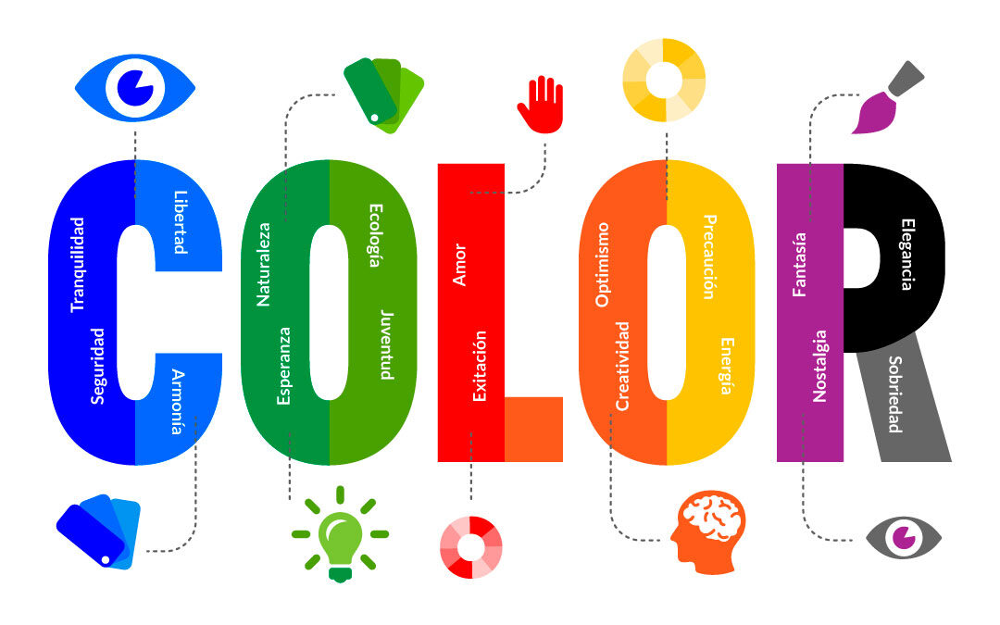
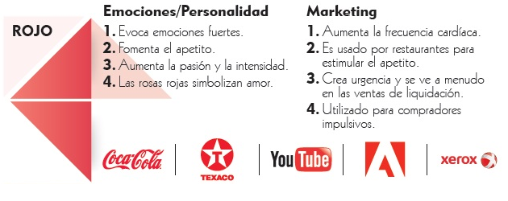
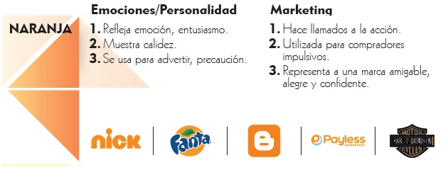
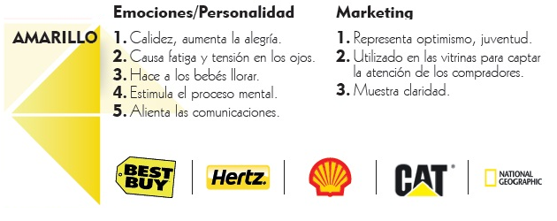
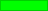
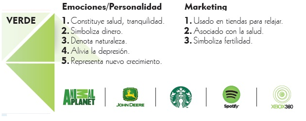
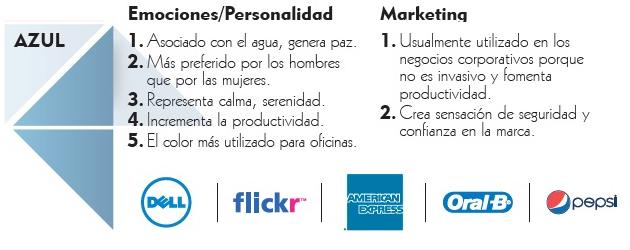
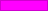
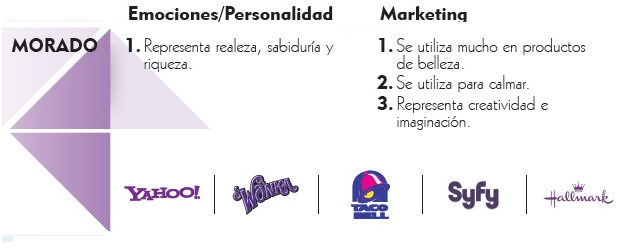
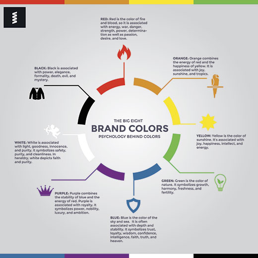

# Disseny Centrat en l'usuari - Disseny d'interfície d'usuari.

# El color en la interfaz d'usuari

## Color roig 

El roig és el color del foc i la sang, per la qual cosa està associat amb l'energia, la guerra, el perill, la força, el poder, la determinació, així com la passió, el desig i l'amor.

El roig és un color molt intens emocionalment. Millora el metabolisme humà, augmenta la taxa de respiració i augmenta la pressió arterial. Té una visibilitat molt alta, per la qual cosa els senyals d'alt, els semàfors i els equips contra incendis generalment estan pintats de roig. En heràldica, el roig s'usa per a indicar coratge. És un color que es troba en moltes banderes nacionals.

El roig porta text i imatges al primer pla. Utilitza-ho com un color d'accent per a estimular a les persones a prendre decisions ràpides; És un color perfecte per als botons **'Comprar ara'** o **'Faça clic ací'** en els bàners i llocs web d'Internet. En publicitat, el roig sovint s'usa per a evocar sentiments eròtics (llavis rojos, ungles roges, districtes de llum roja, 'Lady in Xarxa', etc.). El roig s'usa àmpliament per a indicar perill (senyals d'alt voltatge, semàfors). Aquest color també s'associa comunament amb l'energia, per la qual cosa pot usar-lo quan promociona begudes energètiques, jocs, automòbils, articles relacionats amb l'esport i l'alta activitat física.

- **El roig cla**r representa alegria, sexualitat, passió, sensibilitat i amor.
- **Rosa** significa romanç, amor i amistat. Denota qualitats femenines i passivitat.
- **El roig fosc** s'associa amb vigor, força de voluntat, ira, ira, lideratge, coratge, anhel, malícia i ira.
- **Marró** suggereix estabilitat i denota qualitats masculines.
- **El marró vermellós** s'associa amb la collita i la caiguda.

## Color Taronja 

El taronja combina l'energia del roig i la felicitat del groc. Està associat amb l'alegria, el sol i els tròpics. Representa entusiasme, fascinació, felicitat, creativitat, determinació, atracció, èxit, alé i estimulació.

Per a l'ull humà, el taronja és un color molt càlid, per la qual cosa dóna la sensació de calor. No obstant això, el taronja no és tan agressiu com el roig. La taronja augmenta el subministrament d'oxigen al cervell, produeix un efecte estimulant i estimula l'activitat mental. És altament acceptat entre els joves. Com a color cítric, el taronja s'associa amb aliments saludables i estimula l'apetit. El taronja és el color de la tardor i la collita. 

El taronja té una visibilitat molt alta, per la qual cosa pot usar-ho per a cridar l'atenció i ressaltar els elements més importants del seu disseny. La taronja és molt efectiva per a promocionar productes alimentosos i joguets.

- **El taronja fosc** pot significar engany i desconfiança.
- **El roig ataronjat** correspon al desig, la passió sexual, el plaer, la dominació, l'agressió i la set d'acció.
- **L'or** evoca la sensació de prestigi. El significat de l'or és il·luminació, saviesa i riquesa. L'or sovint simbolitza l'alta qualitat.

## Color groc  

El groc és el color del sol. S'associa amb alegria, felicitat, intel·lecte i energia.

El groc produeix un efecte de calfament, desperta alegria, estimula l'activitat mental i genera energia muscular. El groc sovint s'associa amb el menjar. El groc pur i brillant crida l'atenció, raó per la qual els taxis estan pintats d'aquest color. Quan s'usa en excés, el groc pot tindre un efecte pertorbador; Se sap que els bebés ploren més a les habitacions grogues. El groc es veu abans que altres colors quan es col·loca contra el negre; Aquesta combinació sovint s'utilitza per a emetre un advertiment. 

Usa el groc per a evocar sentiments agradables i alegres. Pot triar el groc per a promocionar productes i articles per a xiquets relacionats amb l'oci. El groc és molt efectiu per a atraure l'atenció, així que usa-ho per a ressaltar els elements més importants del teu disseny. Els homes generalment perceben el groc com un color molt alegre, "infantil", per la qual cosa no es recomana usar groc en vendre productes cars i prestigiosos als homes: ningú comprarà un vestit de negocis groc o un Mercedes groc. El groc és un color inestable i espontani, per tant, evite usar el groc si desitja suggerir estabilitat i seguretat. El groc clar tendeix a desaparéixer en blanc, per la qual cosa generalment necessita un color fosc per a ressaltar-lo. Els tons de groc són visualment poc atractius perquè perden alegria i es tornen bruts.

- **El groc opac** (lúgubre) representa precaució, decadència, malaltia i gelosia.
- **El groc clar** s'associa amb intel·lecte, frescor i alegria.

## Color verd  

El verd és el color de la naturalesa. Simbolitza creixement, harmonia, frescor i fertilitat. Green té una forta correspondència emocional amb la seguretat. El verd fosc també s'associa comunament amb els diners.

El verd té un gran poder curatiu. És el color més reparador per a l'ull humà; Pot millorar la visió. El verd suggereix estabilitat i resistència. A vegades el verd denota falta d'experiència. El verd, en oposició al roig, significa seguretatt.

Utilitza el verd per a indicar seguretat en anunciar medicaments i productes mèdics. El verd està directament relacionat amb la naturalesa, per la qual cosa pot usar-lo per a promocionar productes 'verds'. El verd opac i fosc s'associa comunament amb els diners, el món financer, la banca i Wall Street.

- **El verd fosc** està associat amb l'ambició, la cobdícia i la gelosia.
- **Groc-verd** pot indicar malaltia, covardia, discòrdia i gelosia.
- **El verda oliva** és el color tradicional de la pau.

## Color Blau  

El blau és el color del cel i la mar. Sovint s'associa amb profunditat i estabilitat. Simbolitza confiança, lleialtat, saviesa, confiança, intel·ligència, fe, veritat i cel.

El blau es considera beneficiós per a la ment i el cos. Retarda el metabolisme humà i produeix un efecte calmant. El blau està fortament associat amb la tranquil·litat i la calma. 

Pot usar el blau per a promocionar productes i serveis relacionats amb la neteja (filtres de purificació d'aigua, líquids de neteja, vodka), aire i cel (línies aèries, aeroports, aires condicionats), aigua i mar (viatges marítims, aigua mineral). A diferència dels colors emocionalment càlids com el roig, taronja i groc; El blau està vinculat a la consciència i a l'intel·lecte. Use blau per a suggerir precisió en promocionar productes d'alta tecnologia.

El blau és un color masculí; Segons els estudis, és altament acceptat entre els homes. El blau fosc s'associa amb profunditat, experiència i estabilitat; És un color preferit per a l'Amèrica corporativa.

Evite usar blau quan promoga el menjar i la cuina, perquè el blau suprimeix l'apetit. Quan s'usa juntament amb colors càlids com el groc o el roig, el blau pot crear dissenys vibrants i d'alt impacte; per exemple, blau-groc-roig és un esquema de color perfecte per a un superheroi.

- **El blau és clar** associat amb la salut, la curació, la tranquil·litat, la comprensió i la suavitat.
- **El blau fosc** representa coneixement, poder, integritat i serietat.

## Color magenta 

Combina l'estabilitat del blau i l'energia del roig. El porpra està associat amb la reialesa. Simbolitza poder, noblesa, luxe i ambició. Transmet riquesa i extravagància. El porpra està associat amb la saviesa, la dignitat, la independència, la creativitat, el misteri i la màgia.

Segons les enquestes, quasi el 75 per cent dels xiquets preadolescentes prefereixen el porpra a tots els altres colors. El porpra és un color molt extrany en la naturalesa; Algunes persones ho consideren artificial.

El violeta clar és una bona opció per a un disseny femení. Pot usar un color porpra brillant quan promocione productes per a xiquets.

- **El violeta clar** evoca sentiments romàntics i nostàlgics.
- **El violeta fosc** evoca tristesa i sentiments tristos. Pot causar frustració.

## Color blanc  

El blanc està associat amb la llum, la bondat, la innocència, la puresa i la virginitat. Es considera el color de la perfecció.

Blanc significa seguretat, puresa i neteja. A diferència del negre, el blanc generalment té una connotació positiva. El blanc pot representar un començament reeixit. 

En publicitat, el blanc està associat amb la frescor i la neteja perquè és el color de la neu. Pot usar el blanc per a suggerir simplicitat en productes d'alta tecnologia. El blanc és un color apropiat per a organitzacions de caritat. El blanc està associat amb hospitals, metges i esterilitat, per la qual cosa pot usar el blanc per a suggerir seguretat en promocionar productes mèdics. El blanc sovint s'associa amb baix pes, aliments baixos en greix i productes lactis.

## Color Negre  

El negre s'associa amb poder, elegància, formalitat, mort, maldat i misteri.

El negre és un color misteriós associat amb la por i el desconegut (forats negres). Sol tindre una connotació negativa (llista negra, humor negre). El negre denota força i ​​autoritat; Es considera un color molt formal, elegant i prestigiós (corbata negra, Mercedes negre).

El negre dóna la sensació de perspectiva i profunditat, però un fons negre disminueix la llegibilitat. Un vestit o vestit negre pot fer-te lluir més prima. En dissenyar per a una galeria d'art o fotografia, pot usar un fons negre o gris per a ressaltar els altres colors. El negre contrasta bé amb els colors brillants. Combinat amb roig o taronja, altres colors molt potents, el negre ofereix una combinació de colors molt agressiva. 

  

[back](./colors.html)