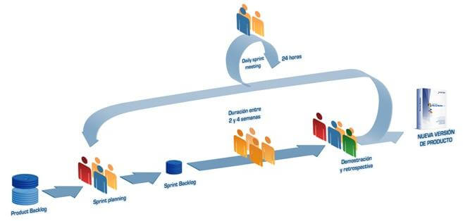

# Procesos i rols d'Scrum.

## El procés

El desenvolupament es realitza de manera iterativa i incremental. Cada iteració, denominada Sprint, té una duració preestablida d'entre 2 i 4 setmanes, obtenint com a resultat una versió del programari amb noves prestacions llestes per a ser usades. En cada nou Sprint, es va ajustant la funcionalitat ja construïda i s'afigen noves prestacions prioritzant-se sempre aquelles que aporten major valor de negoci.

- **Product Backlog**: Conjunt de requisits demoninats històries descrits en un llenguatge no tècnic i prioritzats per valor de negoci, o cosa que és el mateix, per retorn d'inversió considerant el seu benefici i cost. Els requisits i prioritats es revisen i ajusten durant el curs del projecte a intervals regulars.
- **Sprint Planning**: Reunió durant la qual el Product Owner presenta les històries del backlog per ordre de prioritat. L'equip determina la quantitat d'històries que pot comprometre's a completar en aqueix sprint, per a en una segona part de la reunió, decidir i organitzar com l'aconseguirà.
- **Sprint**: Iteració de duració prefixada durant la qual l'equip treballa per a convertir les històries del Product Backlog a les quals s'ha compromés, en una nova versió del programari totalment operatiu.
- **Sprint Backlog**: Llista de les tasques necessàries per a dur a terme les històries del sprint.
- **Daily sprint meeting**: Reunió diària de com màxim 15 min. en la qual l'equip se sincronitza per a treballar de manera coordinada. Cada membre comenta que va fer el dia anterior, que farà hui i si hi ha impediments.
- **Demo i retrospectiva**: Reunió que se celebra al final del sprint i en la qual l'equip presenta les històries aconseguides mitjançant una demonstración del producte. Posteriorment, en la retrospectiva, l'equip analitza què es va fer bé, quins processos serien millorables i discuteix sobre com perfeccionar-los.

## Rols 

En Scrum, l'equip es focalitza a construir programari de qualitat. La gestió d'un projecte Scrum es centra en definir quines són les característiques que ha de tindre el producte a construir (què construir, què no i en quina ordre) i a véncer qualsevol obstacle que poguera entorpir la tasca de l'equip de desenvolupament.

L'equip Scrum està format pels següents rols:

- **Scrum màster**: Persona que lidera a l'equip guiant-lo perquè complisca les regles i processos de la metodologia. Gestiona la reducció d'impediments del projecte i treballa amb el Product Owner per a maximitzar el ROI (Retorn de l'inversió).
- **Product owner (PO)**: Representant dels accionistes i clients que usen el programari. Es focalitza en la part de negoci i l'és responsable del *ROI del projecte* (entregar un valor superior als diners invertits). Trasllada la visió del projecte a l'equip, formalitza les prestacions en històries a incorporar en el Product Backlog i les reprioriza de manera regular.
- **Team**: Grup de professionals amb els coneixements tècnics necessaris i que desenvolupen el projecte de manera conjunta duent a terme les històries a les quals es comprometen a l'inici de cada sprint.

[back](./scrum.html)
