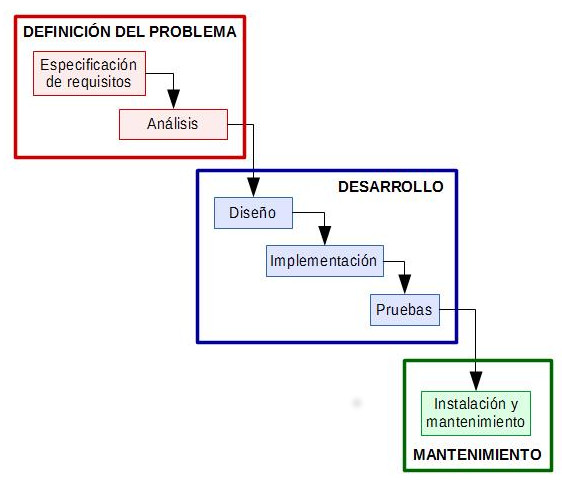

## Metodologia Scrum.

### Antecedents

Existeixen una gran varietat de metodologies per administrar projectes de desnvolupament de Sw. Un dels que més s'ha utilitzat va ser el mòdel en cascada.  Es tractad'un mòdel secuencial on una etapa de desenvolupament no pot iniciar-se fins que l'etapa anterior no s'ha finalitzat. En particular, les etapes de desenvolupament d'aquest mòdel són:

Les diferents parts que tenim:
--  Anàlisi de requisits: on es parla amb el client sobre els requisits i les necessitats. Per tal de identificar els objectius del projecte a desenvolupar. En aquesta etapa es determinen TOTS els requisits que tindrà el sistema. Encara que en etapes posterior es poden identificar, no podran ser inclosos en el projecte.
-- Disseny:  on es dissenyen tots els mòduls del sistema: es dissenya la BB.DD, es defineix l'arquitectura de dades, etc... El sistema es descomposa i organitza en elements que poden desenvolupar-se per separat amb el fí de aprofitar les avantatges del desenvolupament en equip. 
  És convenient distingir entre disseny d'alt nivell o arquitectònic i disseny detallat. El primer d'ells té com a objectiu definir l'estructura de la solució (una vegada que la fase d'anàlisi ha descrit el problema) identificant grans mòduls (conjunts de funcions que estaran associades) i les seves relacions. Amb això es defineix l'arquitectura de la solució triada. El segon defineix els algorismes emprats i l'organització del codi per a començar la implementació.
 - implementació: On es codifiquen cadascún dels mòduls, implementant el còdi font i fent us de prototips, probes i asjos per corregir errors. Depenent del llenguatge de programació i la versió es poden utilitzar les biblioteques o elements reutilitzables dintre del mateix projecte. Així fem que la programació siga molt més ràpida.
 - Probes e integració: És el moment on s'integren els mòdulsi es realitzen les probes unitaries, modulars, integrals i d'aceptació.
 - Verificació: on l'usuari final executa el sistema. A aquesta etapa s'aplega despres de que els programadors han realitzat exaustives probes per comprobar que el sistema no falla.
 - Manteniment: És una de les etapes més critiques. En ella es destinen un 75% dels recursos. el seu objectiu es mantenir el software desenvolupat, ja que pot ser que no acomplixca amb totes les nostres expectatives.
 Aquesta metodologia era excesivament rigida. En ella, rarament s'introduien canvis en la planificació inicial. Ja que implicava el redisseny e implementació de totes les parts afectades, augment de costs i duració del desenvolupament. 
 Com a solució, en febrer del 2001. Un grup d'experts en l'industria del software van crear la alianza àgil i van publicar el manifest en el que definien formes millors de desenvolupar software. A través d'aquest treball van aprendre a valorar cuatre aspectes:
 1. Individus e interaccions Vs procesos i ferramentes.
 2. Software funcionant Vs documentació
 3. Comunicació amb el client Vs negociació contractual.
 4. Resposta al canvi Vs seguir el "pla"
 Encara que es segueixen valorant-se els aspectes de la dreta, es valoren més els aspectes que trobem a l'esquerra. A partir d'aquest treball va sorgir l'enfoque àgil. On l'equip que desenvolupa el software és multidisciplinar, Autoorganitzat, colaboratiu i amb capacitat de prendre decisions a curt termini.En aquest sentit, han sorgit diferents tecnologies, técniques o frameworks àgils com pot ser RUP, LEAN, 3x3, Kanban o SCRUM.
 
## SCRUM
 
[back](../metiprot.html)
